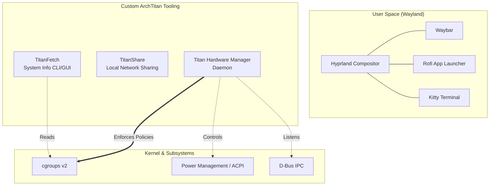
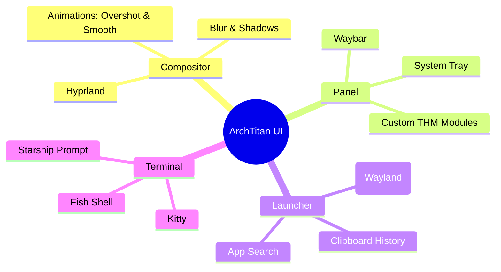
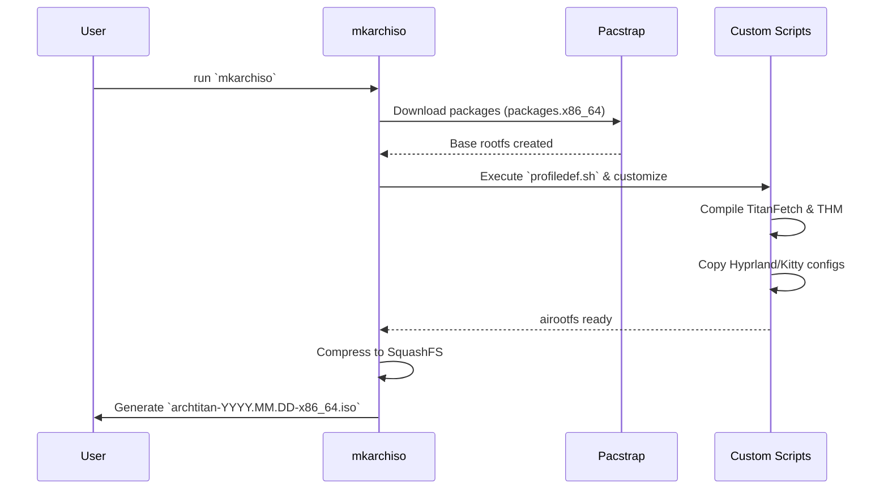

# 🌌 ArchTitan OS

ArchTitan is a custom, high-performance Linux distribution built on top of Arch Linux. Designed around the modern Wayland ecosystem, it offers a deeply integrated, aesthetically pleasing, and resource-efficient environment tailored for power users, developers, and enthusiasts.

---

## 🎯 Core Philosophy

ArchTitan embraces the Unix philosophy while providing a cohesive, pre-configured premium experience out of the box.

- **Wayland Native:** Powered by the **Hyprland** dynamic tiling window manager.
- **Resource Aware:** Features custom daemons like the **Titan Hardware Manager (THM)** for deterministic system-level resource orchestration.
- **Aesthetic First:** Deeply integrated **Catppuccin Mocha** dark theme across all UI elements, terminals, and custom tools.
- **Developer Ready:** Ships with modern CLI tools, an optimized `fish` + `starship` shell experience, and built-in IDE support.

---

## 🏗️ System Architecture

ArchTitan isn't just a collection of packages; it introduces custom middleware to bridge the gap between the window manager and the underlying hardware.



### 🛠️ Custom Components

1. **Titan Hardware Manager (`titan-hwm`)** — *@GitGuru29*
   A privileged systemd service that dynamically orchestrates system resources. It intercepts power events, monitors Wayland session states, and aggressively manages background tasks using `cgroups v2` to ensure the active desktop session remains flawlessly smooth.
   
2. **TitanFetch (`titanfetch`)** — *@GitGuru29*
   A blazing-fast, C++/Qt6-based system information tool. It replaces traditional Bash fetch scripts, offering both a beautiful terminal ASCII output and a premium, draggable GUI card with live progress bars for hardware usage.

3. **Titan Sandbox (`titan-sandboxd`)** — *@GitGuru29*
   A secure container and isolation subsystem leveraging Linux namespaces, seccomp-bpf filters, and capability drops with TOML-based policy enforcement for sandboxed application execution.

4. **Titan Settings** — *@GitGuru29*
   A unified system configuration panel for managing OS-level settings, subsystem configs, and user preferences. *(In Development)*

5. **Auto GPU Switcher** — *@GitGuru29*
   Intelligent iGPU/dGPU switching based on workload, power state, and thermal conditions with THM integration. *(In Development)*

6. **TITAN AI** — *Teammate*
   AI-powered developer assistant and repository introspection subsystem. *(In Development)*

7. **TITAN Task Manager** — *Teammate*
   Advanced process and task scheduling manager. *(In Development)*

8. **TITAN Share** — *Teammate*
   Peer-to-peer local network file sharing daemon with Android client. *(In Development)*

9. **TITAN Mirror** — *Teammate*
   Wayland-native screen mirroring for Android devices. *(In Development)*

---

## 📸 Desktop Environment

ArchTitan uses a meticulously crafted Hyprland configuration.



### ⌨️ Essential Keybindings

| Shortcut | Action |
| :--- | :--- |
| <kbd>Super</kbd> + <kbd>Return</kbd> | Open Kitty Terminal |
| <kbd>Super</kbd> / <kbd>Super</kbd> + <kbd>Space</kbd> | Open Rofi App Launcher |
| <kbd>Super</kbd> + <kbd>W</kbd> | Open Web Browser |
| <kbd>Super</kbd> + <kbd>E</kbd> | Open File Manager (Ranger) |
| <kbd>Super</kbd> + <kbd>Q</kbd> | Close active window |
| <kbd>Super</kbd> + <kbd>F</kbd> | Toggle Fullscreen |
| <kbd>Super</kbd> + <kbd>V</kbd> | Open Clipboard History |
| <kbd>Super</kbd> + <kbd>I</kbd> | Launch Calamares System Installer |
| <kbd>Super</kbd> + <kbd>Shift</kbd> + <kbd>S</kbd> | Take Screenshot |

---

## 🚀 Building the Live ISO

ArchTitan is built using the official `archiso` tooling. 

### Prerequisites
You need an existing Arch Linux host system with the following tools installed:
```bash
sudo pacman -S archiso git
```

### Build Process
The build process compiles the custom tools, pulls down the latest Arch Linux packages, and generates a bootable `.iso` image.



**Commands:**
```bash
# Clone the repository
git clone https://github.com/GitGuru29/archtitan-os.git
cd archtitan-os

# Clean previous build artifacts
sudo rm -rf tmp-work out

# Build the ISO
sudo mkarchiso -v -w tmp-work/ -o out/ ./
```

The resulting ISO will be located in the `out/` directory.

---

## 💻 Installation

### Bare Metal
1. Flash the ISO to a USB drive using Rufus, BalenaEtcher, or `dd`.
2. Boot from the USB (Ensure **UEFI** mode is enabled in your BIOS/Firmware).
3. Once the live Hyprland desktop loads, press <kbd>Super</kbd> + <kbd>I</kbd> to launch the **Calamares Graphical Installer**.
4. Follow the prompts to partition your disk and install ArchTitan.

### Virtual Machine (VirtualBox)
If testing inside VirtualBox, you **must** configure the following settings before booting, otherwise the Wayland compositor will crash:
- **System -> Motherboard:** Check `Enable EFI (special OSes only)`
- **Display -> Screen:** Set Video Memory to `128 MB`
- **Display -> Screen:** Check `Enable 3D Acceleration`
- **Display -> Screen:** Set Graphics Controller to `VMSVGA`

---

## 👥 Team Structure & Subsystem Ownership

This is a **group project** with 4 members. The repository is organized into dedicated subsystem directories under `subsystems/`, each with an identical standardized layout.

### Subsystem Assignment

| Subsystem | Owner | Status | Directory |
| :--- | :--- | :--- | :--- |
| **Titan Hardware Manager** | @GitGuru29 (Lead) | 🟢 Shipped | `subsystems/titan-hwm/` |
| **TitanFetch** | @GitGuru29 (Lead) | 🟢 Shipped | `subsystems/titan-fetch/` |
| **Titan Sandbox** | @GitGuru29 (Lead) | 🟢 Shipped | `subsystems/titan-sandbox/` |
| **Titan Settings** | @GitGuru29 (Lead) | 🟡 In Dev | `subsystems/titan-settings/` |
| **Auto GPU Switcher** | @GitGuru29 (Lead) | 🟡 In Dev | `subsystems/auto-gpu-switcher/` |
| **TITAN AI** | Teammate | 🟡 In Dev | `subsystems/titan-ai/` |
| **TITAN Task Manager** | Teammate | 🟡 In Dev | `subsystems/titan-task-manager/` |
| **TITAN Share** | Teammate | 🟡 In Dev | `subsystems/titan-share/` |
| **TITAN Mirror** | Teammate | 🟡 In Dev | `subsystems/titan-mirror/` |

### Standard Subsystem Layout

Every subsystem folder follows this identical structure:

```
subsystems/<subsystem-name>/
├── src/        ← Source code
├── tests/      ← Unit & integration tests
├── docs/       ← Subsystem-specific documentation
├── configs/    ← Default config files for OS integration
└── README.md   ← Overview, build instructions, dependencies
```

---

## 🚨 Repository Rules & Contribution Guidelines

> **⚠️ All team members MUST read and follow these rules before contributing.**

### 🔒 Branch Protection

- The `main` branch is **protected**. No one can push directly to `main` (except repository admin for emergencies).
- All changes **must** go through a **Pull Request (PR)**.
- Every PR requires **at least 1 approval** from @GitGuru29 before merging.
- Stale approvals are **automatically dismissed** when new commits are pushed.
- **Force pushes** to `main` are **blocked** for everyone.

### 📁 Work Scope Rules

- Each team member works **ONLY inside their assigned** `subsystems/<name>/` **directory**.
- **DO NOT** modify any files outside your subsystem folder without explicit permission from @GitGuru29.

### 🛡️ Protected OS Core Files (CODEOWNERS)

The following paths are protected via `.github/CODEOWNERS`. Any PR touching these files **automatically requires approval from @GitGuru29** and **cannot be merged** without it:

| Protected Path | Description |
| :--- | :--- |
| `airootfs/` | OS rootfs overlay — systemd units, configs, binaries |
| `efiboot/` & `grub/` | Boot configuration |
| `titan-hwm-source/` | Titan Hardware Manager source |
| `titanfetch-src/` | TitanFetch source |
| `sandbox/` | Titan Sandbox source |
| `packages.x86_64` | Package list for the ISO |
| `pacman.conf` | Repository/mirror configuration |
| `profiledef.sh` | ISO build metadata & permissions |
| `install.sh` | Local host installer script |
| `run-vm.sh` | QEMU test runner |
| `.github/` | CI workflows & governance files |

### 📋 Pull Request Workflow

```
1. Clone the repo
   git clone https://github.com/GitGuru29/archtitan-os.git

2. Create your feature branch (NEVER work on main)
   git checkout -b feat/<your-subsystem>-<feature-name>

3. Work ONLY inside your subsystem folder
   subsystems/<your-subsystem>/src/

4. Commit and push your branch
   git add .
   git commit -m "feat(<subsystem>): description"
   git push origin feat/<your-subsystem>-<feature-name>

5. Open a Pull Request on GitHub targeting `main`

6. Complete the PR checklist confirming you only touched your files

7. Wait for approval from @GitGuru29

8. Once approved → Squash and Merge
```

### ✅ PR Checklist (enforced via template)

Every PR must confirm:
- [ ] I only modified files inside `subsystems/<my-subsystem>/`
- [ ] I did **NOT** touch `airootfs/`, `titan-hwm-source/`, `titanfetch-src/`, `sandbox/`, or any OS build files
- [ ] My code builds without errors
- [ ] I updated my subsystem `README.md` if needed

### 🏷️ Commit Message Convention

Use this format for clean git history:

```
<type>(<subsystem>): <short description>

Examples:
  feat(titan-ai): add initial neural classifier module
  fix(titan-share): resolve mDNS discovery timeout
  docs(titan-mirror): update build instructions
  test(titan-task-manager): add unit tests for scheduler
```

| Type | When to use |
| :--- | :--- |
| `feat` | New feature |
| `fix` | Bug fix |
| `docs` | Documentation only |
| `test` | Adding or updating tests |
| `refactor` | Code change that neither fixes nor adds |
| `ci` | CI/CD workflow changes |

---

## 📚 Documentation

Full project documentation is available on the [GitHub Wiki](https://github.com/GitGuru29/archtitan-os/wiki):

| Topic | Page |
| :--- | :--- |
| System design & layers | [Architecture](https://github.com/GitGuru29/archtitan-os/wiki/Architecture) |
| Build a bootable ISO | [Building the ISO](https://github.com/GitGuru29/archtitan-os/wiki/Building-the-ISO) |
| Install to disk or VM | [Installation Guide](https://github.com/GitGuru29/archtitan-os/wiki/Installation-Guide) |
| Resource orchestration | [Titan Hardware Manager](https://github.com/GitGuru29/archtitan-os/wiki/Titan-Hardware-Manager) |
| App sandboxing | [Titan Sandbox](https://github.com/GitGuru29/archtitan-os/wiki/Titan-Sandbox) |
| System info tool | [TitanFetch](https://github.com/GitGuru29/archtitan-os/wiki/TitanFetch) |
| Desktop config | [Desktop Environment](https://github.com/GitGuru29/archtitan-os/wiki/Desktop-Environment) |
| Repo layout & dev setup | [Developer Guide](https://github.com/GitGuru29/archtitan-os/wiki/Developer-Guide) |
| Roadmap & status | [Roadmap & Status](https://github.com/GitGuru29/archtitan-os/wiki/Roadmap-and-Status) |

---

## 📜 License

This project is open-source and available under the **[Apache License 2.0](LICENSE)**. Arch Linux and other included software packages are subject to their respective upstream licenses.

