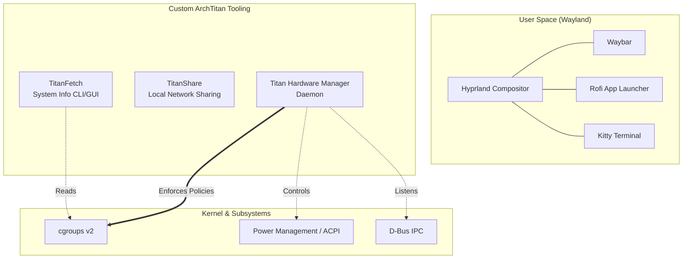
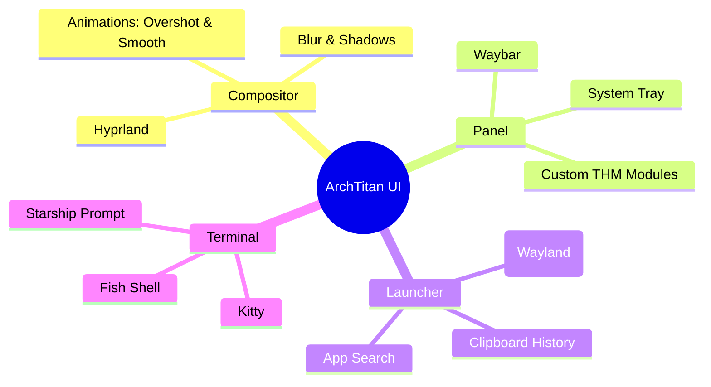
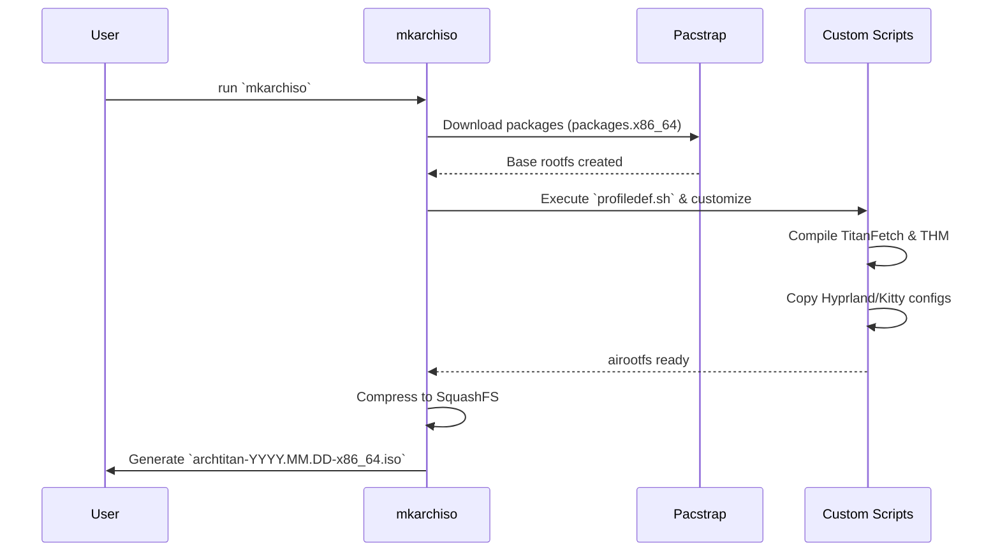

# 🌌 ArchTitan OS

ArchTitan is a custom, high-performance Linux distribution built on top of Arch Linux. Designed around the modern Wayland ecosystem, it offers a deeply integrated, aesthetically pleasing, and resource-efficient environment tailored for power users, developers, and enthusiasts.

---

## 🎯 Core Philosophy

ArchTitan embraces the Unix philosophy while providing a cohesive, pre-configured premium experience out of the box.

- **Wayland Native:** Powered by the **Hyprland** dynamic tiling window manager.
- **Resource Aware:** Features custom daemons like the **Titan Hardware Manager (THM)** for deterministic system-level resource orchestration.
- **Aesthetic First:** Deeply integrated **Catppuccin Mocha** dark theme across all UI elements, terminals, and custom tools.
- **Developer Ready:** Ships with modern CLI tools, an optimized `fish` + `starship` shell experience, and built-in IDE support.

---

## 🏗️ System Architecture

ArchTitan isn't just a collection of packages; it introduces custom middleware to bridge the gap between the window manager and the underlying hardware.



### 🛠️ Custom Components

1. **Titan Hardware Manager (`titan-hwm`)**
   A privileged systemd service that dynamically orchestrates system resources. It intercepts power events, monitors Wayland session states, and aggressively manages background tasks using `cgroups v2` to ensure the active desktop session remains flawlessly smooth.
   
2. **TitanFetch (`titanfetch`)**
   A blazing-fast, C++/Qt6-based system information tool. It replaces traditional Bash fetch scripts, offering both a beautiful terminal ASCII output and a premium, draggable GUI card with live progress bars for hardware usage.

3. **TitanShare**
   An integrated local network file-sharing utility designed for seamless peer-to-peer transfers without requiring complex Samba configurations.

---

## 📸 Desktop Environment

ArchTitan uses a meticulously crafted Hyprland configuration.



### ⌨️ Essential Keybindings

| Shortcut | Action |
| :--- | :--- |
| <kbd>Super</kbd> + <kbd>Return</kbd> | Open Kitty Terminal |
| <kbd>Super</kbd> / <kbd>Super</kbd> + <kbd>Space</kbd> | Open Rofi App Launcher |
| <kbd>Super</kbd> + <kbd>W</kbd> | Open Web Browser |
| <kbd>Super</kbd> + <kbd>E</kbd> | Open File Manager (Ranger) |
| <kbd>Super</kbd> + <kbd>Q</kbd> | Close active window |
| <kbd>Super</kbd> + <kbd>F</kbd> | Toggle Fullscreen |
| <kbd>Super</kbd> + <kbd>V</kbd> | Open Clipboard History |
| <kbd>Super</kbd> + <kbd>I</kbd> | Launch Calamares System Installer |
| <kbd>Super</kbd> + <kbd>Shift</kbd> + <kbd>S</kbd> | Take Screenshot |

---

## 🚀 Building the Live ISO

ArchTitan is built using the official `archiso` tooling. 

### Prerequisites
You need an existing Arch Linux host system with the following tools installed:
```bash
sudo pacman -S archiso git
```

### Build Process
The build process compiles the custom tools, pulls down the latest Arch Linux packages, and generates a bootable `.iso` image.



**Commands:**
```bash
# Clone the repository
git clone https://github.com/GitGuru29/archtitan-os.git
cd archtitan-os

# Clean previous build artifacts
sudo rm -rf tmp-work out

# Build the ISO
sudo mkarchiso -v -w tmp-work/ -o out/ ./
```

The resulting ISO will be located in the `out/` directory.

---

## 💻 Installation

### Bare Metal
1. Flash the ISO to a USB drive using Rufus, BalenaEtcher, or `dd`.
2. Boot from the USB (Ensure **UEFI** mode is enabled in your BIOS/Firmware).
3. Once the live Hyprland desktop loads, press <kbd>Super</kbd> + <kbd>I</kbd> to launch the **Calamares Graphical Installer**.
4. Follow the prompts to partition your disk and install ArchTitan.

### Virtual Machine (VirtualBox)
If testing inside VirtualBox, you **must** configure the following settings before booting, otherwise the Wayland compositor will crash:
- **System -> Motherboard:** Check `Enable EFI (special OSes only)`
- **Display -> Screen:** Set Video Memory to `128 MB`
- **Display -> Screen:** Check `Enable 3D Acceleration`
- **Display -> Screen:** Set Graphics Controller to `VMSVGA`

---

## 📖 Documentation & Wiki

For comprehensive information on configuring and using ArchTitan OS, please refer to the project's [Wiki](wiki/Home.md). 

The Wiki includes in-depth guides on:
- [System Architecture](wiki/Architecture.md)
- [Building the ISO](wiki/Building-the-ISO.md)
- [Titan Hardware Manager (THM)](wiki/Titan-Hardware-Manager.md)
- [Titan Sandbox](wiki/Titan-Sandbox.md)
- [TitanFetch](wiki/TitanFetch.md)
- [Developer Guide](wiki/Developer-Guide.md)

---

## 📜 License
This project is open-source and available under the MIT License. Arch Linux and other included software are subject to their respective licenses.
