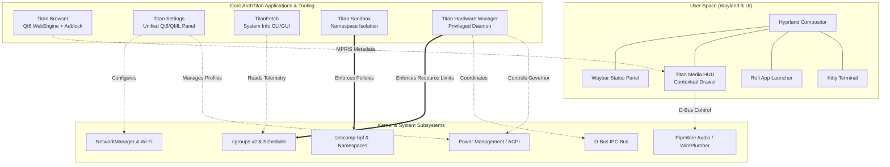
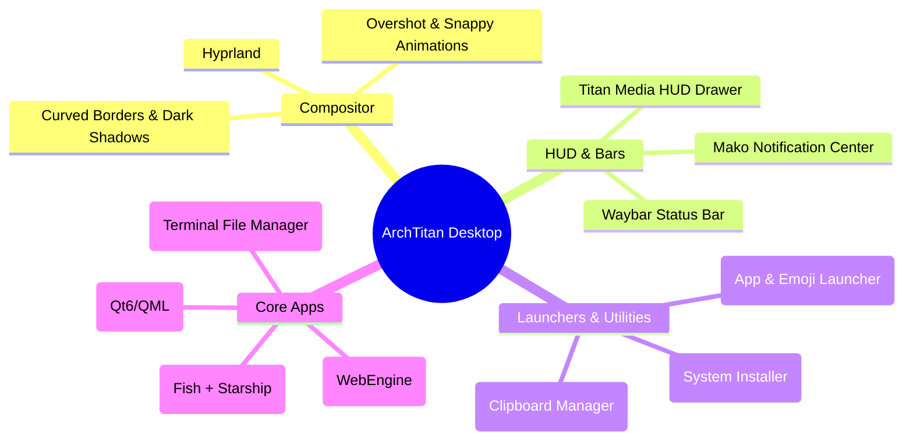
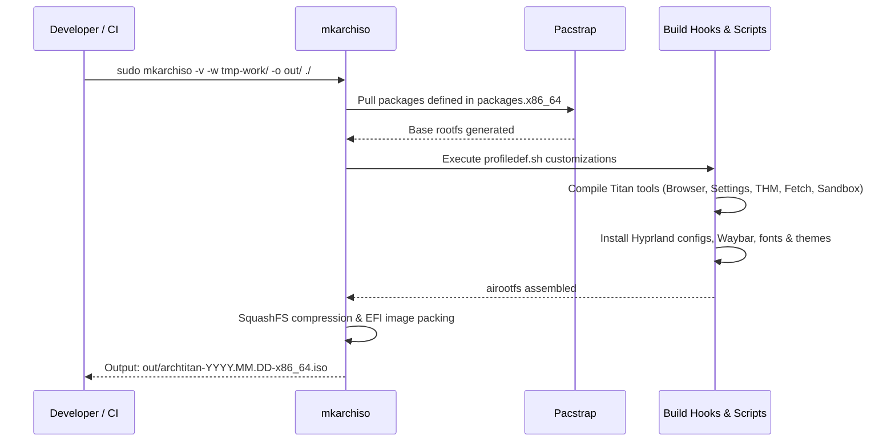

#  ArchTitan OS

[](https://archlinux.org/)
[-00C8FF?logo=wayland&logoColor=white)](https://hyprland.org/)
[](https://www.qt.io/)
[](https://github.com/catppuccin/catppuccin)
[](LICENSE)

ArchTitan is a custom, high-performance Linux distribution built on top of Arch Linux. Designed around the modern Wayland ecosystem, it offers a deeply integrated, aesthetically pleasing, and resource-efficient environment tailored for power users, developers, and enthusiasts.

---

##  Core Philosophy

ArchTitan embraces the Unix philosophy while providing a cohesive, pre-configured premium experience out of the box.

- **Wayland Native:** Powered by the **Hyprland** dynamic tiling window manager with fluid animations and responsive window rules.
- **Resource Aware:** Features custom daemons like the **Titan Hardware Manager (THM)** for deterministic system-level resource orchestration.
- **Aesthetic First:** Deeply integrated **Catppuccin Mocha** dark theme across all UI elements, terminals, browsers, and custom tools.
- **Privacy & Security Focused:** Process sandboxing via Linux namespaces & seccomp-bpf, plus native ad & tracker blocking in Titan Browser.
- **Developer Ready:** Ships with modern CLI utilities, an optimized `fish` + `starship` shell experience, PipeWire audio, and Qt6 development toolchains.

---

##  System Architecture

ArchTitan bridges the gap between the modern Wayland compositor, custom middleware, and low-level Linux kernel subsystems:



---

##  Core Components & Ecosystem

ArchTitan provides a suite of native C++ and Qt6 applications built specifically for the OS:

### 1.  Titan Hardware Manager (`titan-hwm`)
* **Lead:** `@GitGuru29` | **Location:** `titan-hwm-source/` & `subsystems/titan-hwm/`
* Privileged systemd daemon orchestrating CPU, RAM, and background workloads using `cgroups v2`.
* Real-time thermal and power-state throttling with Wayland session awareness to guarantee frame rates for active desktop workflows.

### 2.  Titan Settings (`archtitan-settings`)
* **Lead:** `@GitGuru29` | **Location:** `archtitan-settings/`
* Unified Qt6/QML system control center featuring:
  - **Appearance:** Theme toggle, accent colors, panel opacity, icon sets.
  - **Display:** Brightness, Night Light (`wlsunset`), resolution, and scale factor.
  - **Audio:** Output/input volume, live PipeWire EQ audio visualizer.
  - **Power:** Universal stateful power profile cycling (**Power Saver** ➔ **Balanced** ➔ **Performance** via `Super + P` / `Fn + P`).
  - **Network & Security:** NetworkManager Wi-Fi scanner, Titan Sandbox status, screen autolock, and firewall inspection.

### 3.  Titan Browser (`titan-browser`)
* **Lead:** `@GitGuru29` | **Location:** `titan-browser-source/`
* Fast, lightweight web browser built on **Qt6 WebEngine** with native Wayland rendering:
  - Glassmorphic UI matching the system-wide Catppuccin Mocha aesthetic.
  - Multi-tab management, smart URL/search bar (DuckDuckGo integration).
  - Built-in network-level & DOM ad-blocker optimized for YouTube and Spotify streaming without player stalls.
  - Featherweight binary footprint (~2–3 MB) reusing shared system Qt6 libraries.

### 4.  Titan Sandbox (`titan-sandboxd`)
* **Lead:** `@GitGuru29` | **Location:** `sandbox/` & `subsystems/titan-sandbox/`
* Fine-grained application isolation engine using Linux user/mount/PID/network namespaces, seccomp-bpf syscall filtering, and capability drops configured via declarative TOML policy files.

### 5.  Titan Media HUD (`titan-media-hud`)
* **Lead:** `@GitGuru29` | **Location:** `subsystems/titan-media-hud/`
* Dynamic contextual media drawer positioned underneath Waybar:
  - Invisible during idle states (0% CPU impact).
  - Automatically slides down on active media playback via MPRIS D-Bus.
  - Features album art caching, interactive seek bar, and track playback controls.

### 6.  TitanFetch (`titanfetch`)
* **Lead:** `@GitGuru29` | **Location:** `titanfetch-src/` & `subsystems/titan-fetch/`
* High-performance C++/Qt6 system information utility providing both styled terminal ASCII cards and an interactive desktop hardware monitor with live usage meters.

### 7.  Additional Subsystems (In Development)
* **Auto GPU Switcher** (`subsystems/auto-gpu-switcher/`): Intelligent iGPU/dGPU dynamic switching.
* **TITAN AI** (`subsystems/titan-ai/`): Context-aware developer assistant.
* **TITAN Task Manager** (`subsystems/titan-task-manager/`): Advanced scheduling and resource tracking.
* **TITAN Share** (`subsystems/titan-share/`): Peer-to-peer local network discovery and file exchange.
* **TITAN Mirror** (`subsystems/titan-mirror/`): Wayland-native screen mirroring for mobile devices.

---

##  Desktop Environment & Keybindings

ArchTitan uses an optimized Hyprland desktop with smooth bezier curves, subtle drop shadows, and responsive window grouping.



###  Essential Keybindings

| Shortcut | Action | Description |
| :--- | :--- | :--- |
| <kbd>Super</kbd> | Open App Launcher | Launches Rofi application menu |
| <kbd>Super</kbd> + <kbd>Return</kbd> | Terminal | Opens Kitty terminal with Fish shell |
| <kbd>Super</kbd> + <kbd>W</kbd> | Titan Browser | Launches Titan Browser |
| <kbd>Super</kbd> + <kbd>,</kbd> | Titan Settings | Opens unified System Settings panel |
| <kbd>Super</kbd> + <kbd>E</kbd> | File Manager | Opens Ranger in terminal |
| <kbd>Super</kbd> + <kbd>P</kbd> / <kbd>Fn</kbd> + <kbd>P</kbd> | Power Profile Toggle | Cycles Power Saver ➔ Balanced ➔ Performance |
| <kbd>Super</kbd> + <kbd>V</kbd> | Clipboard History | Opens clipboard history picker |
| <kbd>Super</kbd> + <kbd>Shift</kbd> + <kbd>S</kbd> | Screenshot | Area snip copied to clipboard (`grim` + `slurp`) |
| <kbd>Super</kbd> + <kbd>Q</kbd> | Close Window | Closes active window |
| <kbd>Super</kbd> + <kbd>F</kbd> | Fullscreen | Toggles fullscreen mode |
| <kbd>Super</kbd> + <kbd>I</kbd> | System Installer / Settings | Calamares (Live ISO) or Titan Settings (Installed) |
| <kbd>Ctrl</kbd> + <kbd>Alt</kbd> + <kbd>Del</kbd> | Power Menu | Lock, Suspend, Reboot, Shutdown |

---

##  Building the Live ISO

ArchTitan is built using the official Arch Linux `archiso` suite.

### Prerequisites

An Arch Linux host system with `archiso` and `git` installed:
```bash
sudo pacman -S archiso git
```

### Build Workflow



### Build Commands

```bash
# Clone the repository
git clone https://github.com/GitGuru29/archtitan-os.git
cd archtitan-os

# Clean previous build artifacts
sudo rm -rf tmp-work out

# Build the ISO
sudo mkarchiso -v -w tmp-work/ -o out/ ./
```

The generated `.iso` will be placed in the `out/` directory.

---

##  Installation & Testing

### 1. Bare Metal Installation
1. Flash the generated ISO to a USB flash drive using `dd`, BalenaEtcher, or Rufus:
   ```bash
   sudo dd if=out/archtitan-*.iso of=/dev/sdX bs=4M status=progress oflag=sync
   ```
2. Boot the target machine in **UEFI mode** (disable Secure Boot).
3. On the live desktop, launch the **Calamares Graphical Installer** (<kbd>Super</kbd> + <kbd>I</kbd>).
4. Follow the step-by-step partition and user setup wizards to complete the installation.

### 2. QEMU / KVM Quick Runner
Use the bundled `run-vm.sh` script to test live or installed builds in QEMU:

```bash
# Boot the live ISO
./run-vm.sh

# Boot from installed qcow2 virtual disk
./run-vm.sh --disk

# Wipe disk and perform fresh reinstall
./run-vm.sh --fresh
```

### 3. VirtualBox Configuration
When testing inside VirtualBox, ensure the following VM settings are enabled to support Wayland:
- **System ➔ Motherboard:** Check `Enable EFI (special OSes only)`
- **Display ➔ Screen:** Video Memory = `128 MB`, Graphics Controller = `VMSVGA`
- **Display ➔ Screen:** Check `Enable 3D Acceleration`

---

##  Team Structure & Subsystem Ownership

ArchTitan is developed as a modular group project with 4 members. The repository is organized into core OS components at the root and dedicated subsystem packages in `subsystems/`.

### Core OS Components vs. Subsystems

| Component | Category | Owner | Status | Directory |
| :--- | :--- | :--- | :--- | :--- |
| **Titan Hardware Manager** | Core Daemon | @GitGuru29 (Lead) | 🟢 Shipped | `titan-hwm-source/` & `subsystems/titan-hwm/` |
| **Titan Settings** | Core App | @GitGuru29 (Lead) | 🟢 Active | `archtitan-settings/` |
| **Titan Browser** | Core App | @GitGuru29 (Lead) | 🟢 Active | `titan-browser-source/` |
| **Titan Sandbox** | Core Subsystem | @GitGuru29 (Lead) | 🟢 Shipped | `sandbox/` & `subsystems/titan-sandbox/` |
| **TitanFetch** | Core Utility | @GitGuru29 (Lead) | 🟢 Shipped | `titanfetch-src/` & `subsystems/titan-fetch/` |
| **Titan Media HUD** | Companion App | @GitGuru29 (Lead) | 🟢 Active | `subsystems/titan-media-hud/` |
| **Auto GPU Switcher** | Subsystem | @GitGuru29 (Lead) | 🟡 In Dev | `subsystems/auto-gpu-switcher/` |
| **TITAN AI** | Subsystem | Teammate | 🟡 In Dev | `subsystems/titan-ai/` |
| **TITAN Task Manager** | Subsystem | Teammate | 🟡 In Dev | `subsystems/titan-task-manager/` |
| **TITAN Share** | Subsystem | Teammate | 🟡 In Dev | `subsystems/titan-share/` |
| **TITAN Mirror** | Subsystem | Teammate | 🟡 In Dev | `subsystems/titan-mirror/` |

### Subsystem Directory Layout

All subsystem packages follow this standard structure:

```
subsystems/<subsystem-name>/
├── src/        ← Source code
├── tests/      ← Unit, integration, and service tests
├── docs/       ← Subsystem-specific documentation
├── configs/    ← Configuration files for OS rootfs integration
└── README.md   ← Subsystem overview, build steps, and dependencies
```

---

## 🚨 Repository Rules & Contribution Guidelines

> **⚠️ All team members must review and adhere to these guidelines before submitting changes.**

### 🔒 Branch Protection & Pull Requests

- The `main` branch is protected. Direct commits are restricted.
- All contributions must be submitted via a **Pull Request (PR)** targeting `main`.
- PRs require at least **1 review and approval** from `@GitGuru29` before merging.
- Contributors must work exclusively within their assigned `subsystems/<name>/` directories.

### 🛡️ Protected OS Core Files (`CODEOWNERS`)

Changes affecting base OS configurations and core tooling require explicit review by `@GitGuru29`:

| Protected Path | Purpose |
| :--- | :--- |
| `airootfs/` | Rootfs overlay (systemd units, dotfiles, desktop configs, binary overlays) |
| `archtitan-settings/` | Titan Settings application source |
| `titan-browser-source/` | Titan Browser source and resources |
| `titan-hwm-source/` | Titan Hardware Manager daemon source |
| `titanfetch-src/` | TitanFetch utility source |
| `sandbox/` | Titan Sandbox daemon & policy parser source |
| `efiboot/` & `grub/` | EFI & GRUB bootloader configurations |
| `packages.x86_64` | Package manifest for live ISO generation |
| `pacman.conf` | Pacman package manager and custom repository configuration |
| `profiledef.sh` | Archiso build profile definitions and permissions |
| `install.sh` & `run-vm.sh` | Host installer and QEMU virtual test harness |
| `.github/` | CI/CD automation workflows and repository governance |

### 🏷️ Commit Message Format

```
<type>(<scope>): <short description>

Examples:
  feat(titan-browser): add native Qt6 directory picker for download location
  fix(settings): implement universal power profile cycling hotkey
  feat(titan-media-hud): add async album art caching and MPRIS seeker
  docs(readme): update system architecture and core components guide
```

---

## 📚 Documentation & Resources

Comprehensive guides and technical documentation are available on the [ArchTitan OS Wiki](https://github.com/GitGuru29/archtitan-os/wiki):

| Topic | Description | Link |
| :--- | :--- | :--- |
| **System Architecture** | Subsystem layers, D-Bus IPC, and kernel interfaces | [Architecture Guide](https://github.com/GitGuru29/archtitan-os/wiki/Architecture) |
| **Building the ISO** | Archiso compilation steps and dependency handling | [Build Documentation](https://github.com/GitGuru29/archtitan-os/wiki/Building-the-ISO) |
| **Installation Guide** | UEFI partitioning, live environment, and dual-booting | [Installation Manual](https://github.com/GitGuru29/archtitan-os/wiki/Installation-Guide) |
| **Hardware Manager** | cgroups v2 resource orchestration and power policies | [THM Documentation](https://github.com/GitGuru29/archtitan-os/wiki/Titan-Hardware-Manager) |
| **Titan Sandbox** | Namespaces, capability drops, and TOML policies | [Sandbox Manual](https://github.com/GitGuru29/archtitan-os/wiki/Titan-Sandbox) |
| **Desktop Environment** | Hyprland config, Waybar widgets, and themes | [Desktop Configuration](https://github.com/GitGuru29/archtitan-os/wiki/Desktop-Environment) |
| **Developer Guide** | Subsystem development and contributor standards | [Developer Guide](https://github.com/GitGuru29/archtitan-os/wiki/Developer-Guide) |

---

## 📜 License

This project is licensed under the **[Apache License 2.0](LICENSE)**. Arch Linux and upstream package software remain subject to their respective licenses.
