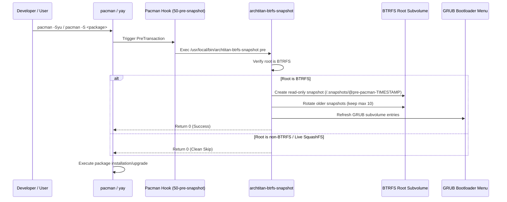

# BTRFS Automatic Snapshot Hook — Implementation Plan

This document outlines the architecture, pacman hook specifications, bash snapshot management script, rotation policy, and GRUB bootloader integration for ArchTitan OS's automated BTRFS snapshot system.

---

## 1. Feature Goals

- **Pre-Transaction Safety**: Automatically capture a read-only root (`/`) BTRFS snapshot prior to any package installation, removal, or system upgrade performed by `pacman` or `yay`.
- **Non-Blocking Execution**: Ensure non-BTRFS root filesystems (e.g. ext4) or live ISO squashfs overlays safely skip snapshot creation without causing `pacman` transactions to fail.
- **Automated Snapshot Rotation**: Maintain a clean, bounded snapshot history by automatically retaining only the 10 most recent pre-update snapshots (`/.snapshots/@pre-pacman-YYYYMMDD-HHMMSS`).
- **GRUB Boot Integration**: Automatically register pre-update subvolume snapshots in the GRUB bootloader menu via `grub-btrfs`, allowing instant system rollback directly from the UEFI boot screen.

---

## 2. Component Specifications

### A. Pacman Pre-Transaction Hook
**Path**: `airootfs/etc/pacman.d/hooks/50-archtitan-btrfs-pre-snapshot.hook`

```ini
[Trigger]
Operation = Install
Operation = Upgrade
Operation = Remove
Type = Package
Target = *

[Action]
Description = ArchTitan OS: Creating pre-transaction BTRFS snapshot...
When = PreTransaction
Exec = /usr/local/bin/archtitan-btrfs-snapshot pre
```

---

### B. Snapshot Management Script
**Path**: `airootfs/usr/local/bin/archtitan-btrfs-snapshot`

- **Root Filesystem Check**: Uses `findmnt -n -o FSTYPE /` to check if `/` is `btrfs`. Exits with code `0` if not BTRFS.
- **Subvolume Snapshot Creation**: Runs `btrfs subvolume snapshot -r / /.snapshots/@pre-pacman-$(date +%Y%m%d-%H%M%S)`.
- **Rotation Engine**: Sorts `/.snapshots/@pre-pacman-*` by timestamp, keeping the newest 10 and removing older subvolumes via `btrfs subvolume delete`.
- **GRUB Menu Sync**: Triggers `grub-btrfs` / `grub-mkconfig` update to refresh boot entries.

---

### C. System Permissions & Image Profile
**Path**: `profiledef.sh`

Add executable permissions:
```sh
["/usr/local/bin/archtitan-btrfs-snapshot"]="0:0:755"
```

---

### D. Package Manifest
**Path**: `packages.x86_64`

Includes required snapshot and boot packages:
- `btrfs-progs`
- `snapper`
- `grub-btrfs`

---

## 3. Workflow Sequence


