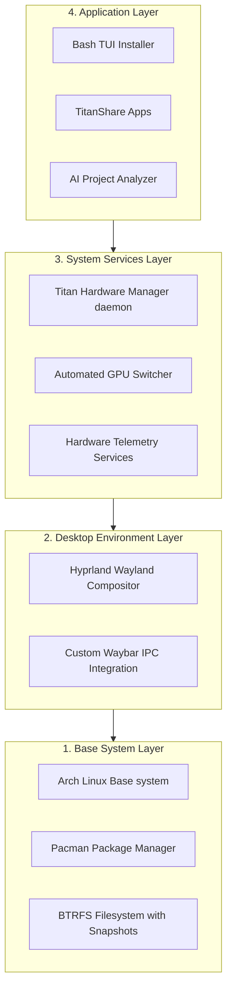
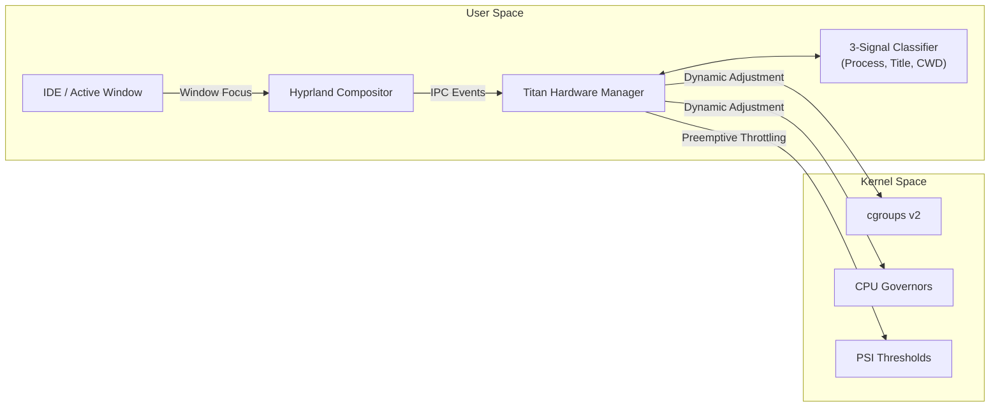

# TitanArch: A Context-Aware, Developer-Focused Custom Linux Distribution

## 1. Introduction
Modern software development demands computing environments that are highly performant, minimal, and purpose-built for specialized workflows. General-purpose operating systems such as Windows, macOS, and mainstream Linux distributions carry significant overhead from background services, telemetry, and unoptimized GUI elements. This overhead translates into wasted CPU cycles, unnecessary memory pressure, and context-switching friction for developers.

TitanArch is a proposed custom Arch Linux-based distribution built from the ground up as a developer-first operating system. Unlike existing distributions that merely patch or re-theme a generic environment, TitanArch is constructed using `archiso` with deliberate component selection at every layer. The result is an OS that is lightweight by design, intelligent in resource allocation, and equipped with first-party developer utilities that do not exist natively in other distributions.

## 2. Problem Statement
Developers working on Linux face a recurring set of friction points that are largely unsolved by existing distributions:

1. **High Idle Resource Consumption:** Mainstream desktop environments (e.g., GNOME, KDE) often consume 800MB–1.5GB RAM at idle before a single development tool is launched.
2. **Static Resource Management:** Existing Linux kernel schedulers and CPU governors operate without application-context awareness. The OS treats a heavy compile job the same as watching a video, failing to dynamically allocate `cgroups v2` limits or swap priorities based on the active workload.
3. **Fragmented Cross-Device Continuity:** File transfer and screen mirroring between Linux and Android rely on heavy, third-party user-space apps (like KDE Connect) or unstable protocols (MTP), rather than being handled natively at the OS daemon level.
4. **Manual Hardware Management:** Hybrid GPU setups (Intel iGPU + NVIDIA/AMD dGPU) require manual configuration or proprietary utilities for switching, lacking seamless user-space integration.
5. **Lack of OS-Level AI Assistance:** Current AI tools are strictly confined to IDE plugins. There is no OS-level intelligence that analyzes project structures and provisions the local environment automatically.

## 3. Aims and Objectives
The primary aim of this project is to design, develop, and deliver a fully bootable, context-aware Linux distribution tailored specifically for software engineers.

**Specific Objectives:**
* Design and build a bootable, installable Arch-based Linux distribution using `archiso`, complete with a custom TUI (Terminal User Interface) installer.
* Develop the **Titan Hardware Manager (THM)**: a context-based performance daemon that monitors active workloads and dynamically adjusts CPU governors, memory slices, and PSI (Pressure Stall Information) thresholds.
* Build **TitanShare & TitanMirror**: native cross-platform peer-to-peer file transfer and screen mirroring systems utilizing mDNS discovery, without requiring cloud connectivity or ADB.
* Implement an **Automated Hybrid GPU Switcher** that manages iGPU/dGPU routing at the user-space level.
* Develop the **AI-Driven Project Analyzer**, an OS-level tool that introspects project directories to recommend and apply compiler flags, environment variables, and IDE settings.
* Create **Neon Monitor**, a zero-overhead C++ terminal hardware dashboard.

## 4. Proposed Solution & Architecture
TitanArch is structured into four distinct architectural layers, ensuring modularity and low latency:

1. **Base System Layer:** Built using `archiso`, utilizing pacman, a curated package selection, and a BTRFS filesystem for snapshot-based recovery.
2. **Desktop Environment Layer:** Powered by the Hyprland Wayland compositor, optimized for a keyboard-driven tiling workflow with custom Waybar IPC integration.
3. **System Services Layer:** The core intelligence layer written in C++17, housing the Titan Hardware Manager (THM) daemon, automated GPU switcher, and hardware telemetry services.
4. **Application Layer:** The user-facing toolset, including the Bash-based TUI installer, TitanShare Android/Linux applications, and the Python-based AI Project Analyzer.

## 5. Novelty and Innovation
The actual novelty of TitanArch lies in **Context-Aware Proactive System Integration.**

* **GUI-to-Kernel Synergy:** In standard OSes, the Display Server and the Kernel are blind to each other. TitanArch bridges the Wayland compositor directly to the kernel's resource manager via low-latency IPC. The kernel instantly knows *what* the developer is looking at (e.g., Android Studio vs. a Web Browser) and shifts resources preemptively.
* **Proactive Resource Determinism:** Rather than reacting to OOM (Out of Memory) panics, TitanArch uses a 3-signal fusion classifier (process trees, window titles, CWD) to intelligently throttle or freeze background tasks *before* the system bottlenecks.
* **Native Ecosystem Continuity:** By building cross-device communication (TitanShare) directly into the OS daemon layer, mobile devices are treated as native extensions of the desktop environment.

## 6. Project Deliverables & Milestones

**Phase 1: Foundation (Completed)**
* [x] Base Archiso build pipeline and bootable ISO.
* [x] Custom Hyprland Wayland compositor integration.
* [x] Custom Bash TUI Installer.

**Phase 2: Core Intelligence (Completed)**
* [x] Titan Hardware Manager (THM) C++ daemon.
* [x] `cgroups v2` and PSI-based escalation ladder.
* [x] V2 Fusion Classifier (Polyglot IDE support, Age Decay, Workspace Tiers).

**Phase 3: Continuity Ecosystem (In Progress)**
* [x] TitanShare Linux Daemon (mDNS, sockets).
* [x] TitanShare Android Application (Jetpack Compose).
* [ ] TitanMirror Android Screen Mirroring implementation.

**Phase 4: Developer Tooling (To Do)**
* [ ] Python-based AI Project Analyzer.
* [ ] Automated Hybrid GPU Switcher (C++).
* [ ] Neon Monitor Hardware Dashboard (C++ TUI).
* [ ] System testing, benchmarking, and Final ISO release.

## 7. Team Responsibilities

* **Siluna Dangalla (Systems / OS Developer):** `archiso` build pipeline, TUI installer, Titan Hardware Manager (THM), GPU switcher, Neon Monitor, TitanShare Linux daemon, AI project analyzer.
* **Kaveesha (UI/UX Developer):** Hyprland desktop environment configuration, installer UX design, Waybar theme, TitanShare Android app UI (Jetpack Compose).
* **Team Member 3 (Network / Backend Developer):** TitanShare mDNS protocol design, local network transfer protocol, profile switching support.
* **Team Member 4 (QA / Testing Engineer):** VM-based system testing, stability validation, integration testing, benchmark documentation.

## 8. Evaluation Metrics
The success of TitanArch will be evaluated against the following benchmarks:
* **Idle RAM Usage:** < 1GB (measured via `free -m` post-boot).
* **Compile Benchmark:** Kernel compilation time parity or improvement compared to an Ubuntu baseline.
* **TitanShare Speed:** >= 50 MB/s on a local Gigabit network.
* **Profile Switch Latency:** < 500ms from window focus to `cgroups`/governor adjustment.
* **Neon Monitor Overhead:** < 0.5% CPU utilization at idle.
