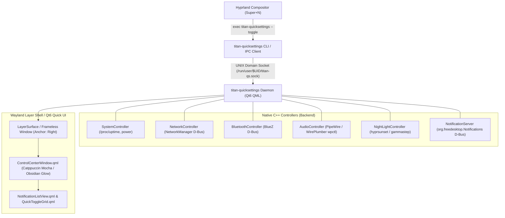

# ArchTitan Native Quick Settings & Notification Center (`titan-quicksettings`)

## Overview
This document outlines the architecture, native Wayland layer-shell windowing, D-Bus services, and C++/QML implementation plan for the **ArchTitan Quick Settings & Notification Center** (`titan-quicksettings`). Built specifically as a first-party native desktop subsystem for ArchTitan OS (Hyprland Wayland compositor), it provides a hardware-accelerated, obsidian glassmorphic control drawer that smoothly slides in from the right edge when the user presses **<kbd>Super</kbd> + <kbd>N</kbd>**.

---

## Visual & Functional Breakdown (Matching Reference Image)

```
┌────────────────────────────────────────────────────────────┐
│ [▲ ArchTitan] Up 25m                    [✎] [↻] [⚙] [⏻]   │  <- Header Bar (/proc/uptime, Settings, Power)
├────────────────────────────────────────────────────────────┤
│  [ (•) Internet         ] [ ᛒ Bluetooth       ] [ ☕ ]     │  <- Row 1 Toggles (NetworkManager, BlueZ, Caffeine)
│       moto g24 power            Not connected              │
│  [ 🎙 Mute ] [ 🔊 Audio: Muted ] [ 🌙 Night Light: Off ]    │  <- Row 2 Toggles (PipeWire/WirePlumber, Hyprsunset)
│  [ ◐ ]   [ ılı ]   [ ≈ ]   [ ☁🔒 ]   [ 🎮 ]                │  <- Row 3 Icon Grid (Theme, Visualizer, Ambient, VPN, Game)
│  [ ⛶ ]   [ 💉 ]   [ ⌨ ]   [ 🔔 ]    [ 🎵 ]                │  <- Row 4 Icon Grid (Grim, Hyprpicker, On-Screen KB, DND, MPRIS)
│  [ 🕬 ]                                                     │  <- Row 5 Mic Mute
├────────────────────────────────────────────────────────────┤
│ ╭────────────────────────────────────────────────────────╮ │
│ │ (•) Network Management         September 12    [21 ▾] │ │  <- Notification Card 1 (NetworkManager D-Bus)
│ │     No Network Connection   You are no longer conn...  │ │
│ ╰────────────────────────────────────────────────────────╯ │
│ ╭────────────────────────────────────────────────────────╮ │
│ │ [A] Antigravity IDE            September 11   [441 ▾] │ │  <- Notification Card 2 (Desktop Notification Spec)
│ │     Antigravity IDE   Host System Troubleshooting Ass...│
│ ╰────────────────────────────────────────────────────────╯ │
│ ╭────────────────────────────────────────────────────────╮ │
│ │ [💬] notify-send               September 10  [8503 ▾] │ │  <- Notification Card 3 (Desktop Notification Spec)
│ │     THM: Reclaiming idle workload "1387655" is idle... │ │
│ ╰────────────────────────────────────────────────────────╯ │
│ ╭────────────────────────────────────────────────────────╮ │
│ │ [💻] Hyprland                  September 08     [2 ▾] │ │  <- Notification Card 4 (Hyprland IPC events)
│ │     Exited Virtual Machine submap   Keybinds re-ena... │ │
│ ╰────────────────────────────────────────────────────────╯ │
├────────────────────────────────────────────────────────────┤
│ [ 🔕 ]               8,967 notifications              [ 🗑 ] │  <- Notification Footer (DND Toggle, Counter, Clear All)
├────────────────────────────────────────────────────────────┤
│ ▲  Thursday, September 17 • 0 tasks                        │  <- Bottom Calendar & Task Bar
└────────────────────────────────────────────────────────────┘
```

---

## System Architecture & Technology Stack

ArchTitan OS utilizes **Hyprland** (Wayland compositor), **Qt6**, and **LayerShellQt** / native Wayland protocols.



### 1. Wayland Windowing & Layer-Shell Integration
- **Position & Anchor**: Anchored to the **Right**, **Top**, and **Bottom** edges of the primary monitor (`layer = overlay` or `layer = top`).
- **Dimensions**: Width 420px, vertical margins 12px, corner radius 18px.
- **Backdrop & Styling**:
  - Catppuccin Mocha / Obsidian dark surface (`#E611111B`, 90% opacity).
  - Subtle 1px cyan/electric blue accent border (`#2E89B4FA`).
  - Native Hyprland blur rule: `layerrule = blur, titan-quicksettings` and `layerrule = ignorezero, titan-quicksettings`.
- **Motion & Slide-in Animation**:
  - Hyprland overshot bezier animation curve: slides in from `x = Screen.width` to `x = Screen.width - width - 12`.
  - Closing triggers reverse slide and unmaps or hides the layer surface.

### 2. IPC & Keybinding Handling (<kbd>Super</kbd> + <kbd>N</kbd>)
- In `airootfs/etc/skel/.config/hypr/hyprland.conf`:
  ```ini
  # ArchTitan Quick Settings & Notification Center — SUPER+N toggle
  bind = $mainMod, N, exec, titan-quicksettings --toggle
  ```
- Single-instance daemon pattern:
  - On login (`exec-once = titan-quicksettings --daemon`), the process launches and creates a listening UNIX domain socket at `$XDG_RUNTIME_DIR/titan-quicksettings.sock`.
  - When the user presses `Super + N`, `titan-quicksettings --toggle` sends a byte over the socket, immediately toggling visibility with zero process startup lag.
  - Clicking outside the window or pressing <kbd>Escape</kbd> loses keyboard focus and hides the drawer.

### 3. Native Linux Backend Controllers (C++)
1. **System Controller (`SystemController.cpp`)**:
   - Reads `/proc/uptime` to format `Up 25m`.
   - Action triggers: launches `archtitan-settings` on `⚙` click, launches `titan-powermenu` on `⏻` click.
2. **Network Manager Controller (`NetworkController.cpp`)**:
   - Connects to D-Bus `org.freedesktop.NetworkManager`.
   - Reads active connection name (e.g. `moto g24 power`), signal strength, and toggles Wi-Fi enabled/disabled.
3. **Bluetooth Controller (`BluetoothController.cpp`)**:
   - Connects to BlueZ D-Bus `org.bluez`.
   - Reads adapter powered state and connected device name; toggles Bluetooth power.
4. **Audio & Mic Controller (`AudioController.cpp`)**:
   - Interacts with PipeWire / WirePlumber via `libpulse` or `wpctl` spawn/D-Bus.
   - Monitors default sink/source mute state and volume level; toggles mute on click.
5. **Night Light Controller (`NightLightController.cpp`)**:
   - Controls `hyprsunset` (or `gammastep`/`wlsunset`) via IPC/process management. Toggles color temperature (e.g. 4500K warmth).
6. **Notification Store & Server (`NotificationServer.cpp`)**:
   - Acquires or integrates with the FreeDesktop notification spec (`org.freedesktop.Notifications`).
   - Maintains notification history in SQLite or structured memory:
     - Groups notifications by `app_name` (e.g. `Network Management`, `Antigravity IDE`, `notify-send`, `Hyprland`).
     - Tracks timestamp, summary, body, icon, and expandable list count (`21 ▾`, `441 ▾`, `8503 ▾`, `2 ▾`).
     - Exposes actions: `dismiss(id)`, `dismissGroup(appName)`, `clearAll()`.
     - Exposes DND (Do Not Disturb) mode to mute incoming notification popups.
7. **Calendar & Date Integration**:
   - Dynamic real-time date (`Thursday, September 17 • 0 tasks`).
   - Task summary integrated with user tasks / system cron or task tracker.

---

## Subsystem Directory Structure

```
subsystems/titan-quicksettings/
├── CMakeLists.txt
├── resources.qrc
├── README.md
├── src/
│   ├── main.cpp                     # Application entrypoint & CLI parser (--daemon, --toggle, --show, --hide)
│   ├── ipcserver.h / .cpp           # UNIX domain socket server & client for instantaneous Super+N toggling
│   ├── systemcontroller.h / .cpp    # Uptime, date, power menu, settings launcher
│   ├── networkcontroller.h / .cpp   # NetworkManager D-Bus connection & Wi-Fi state
│   ├── bluetoothcontroller.h / .cpp # BlueZ D-Bus connection & Bluetooth state
│   ├── audiocontroller.h / .cpp     # PipeWire/WirePlumber volume & mute management
│   ├── nightlightcontroller.h / .cpp# Hyprsunset / color temperature management
│   └── notificationserver.h / .cpp  # Desktop notifications manager & grouped history model
└── qml/
    ├── QuickSettingsWindow.qml      # Wayland LayerSurface / Frameless Overlay Window
    ├── components/
    │   ├── HeaderBar.qml            # ArchTitan logo, uptime badge, 4 header action buttons
    │   ├── LargeToggleTile.qml      # Pill tiles (Internet, Bluetooth, Audio, Night Light)
    │   ├── QuickToggleGrid.qml      # 5x2 squircle toggle buttons (Theme, Cava, DND, Screenshot, etc.)
    │   ├── NotificationCard.qml     # Expandable grouped notification card with badge and chevron
    │   ├── NotificationList.qml     # Scrollable notification history container with custom scrollbar
    │   ├── NotificationFooter.qml   # DND icon, dynamic notification count pill, clear all button
    │   └── CalendarFooter.qml       # Expandable bottom calendar and tasks bar
    └── style/
        └── TitanTheme.qml           # Catppuccin Mocha / Obsidian glow colors and metrics
```

---

## Hyprland & Waybar Integration

### 1. Hyprland Configuration (`airootfs/etc/skel/.config/hypr/hyprland.conf`)
```ini
# Autostart daemon
exec-once = titan-quicksettings --daemon

# Keybinding: Super+N to toggle overlay
bind = $mainMod, N, exec, titan-quicksettings --toggle

# Window & Layer rules for glassmorphic blur and animations
windowrule {
    name = titan-quicksettings-rule
    match:title = ^(titan-quicksettings)$
    float = 1
    noborder = 1
}
layerrule = blur, titan-quicksettings
layerrule = ignorezero, titan-quicksettings
```

### 2. Waybar Notification Bell Integration (`airootfs/etc/skel/.config/waybar/config`)
- Add a custom notification module to Waybar that clicks to toggle the overlay:
  ```json
  "custom/notification": {
      "format": " {icon} ",
      "format-icons": {
          "notification": "󱅫",
          "none": "󰂚",
          "dnd-notification": "󰂛",
          "dnd-none": "󰂛"
      },
      "return-type": "json",
      "exec": "titan-quicksettings --status-json",
      "on-click": "titan-quicksettings --toggle",
      "interval": 2
  }
  ```

---

## Implementation Steps

1. **Subsystem Setup (`subsystems/titan-quicksettings/`)**:
   - Create `CMakeLists.txt` linking Qt6 (`Core`, `Gui`, `Quick`, `Qml`, `DBus`, `Network`, `Widgets`).
   - Create single-instance IPC server (`ipcserver.cpp`) handling `--daemon` and `--toggle` arguments.
2. **Backend Controllers (C++)**:
   - Implement `SystemController`, `NetworkController`, `BluetoothController`, `AudioController`, `NightLightController`.
   - Implement `NotificationServer` D-Bus listener with grouped history model.
3. **QML Interface**:
   - Build `QuickSettingsWindow.qml` with Wayland layer surface positioning (top-right-bottom anchor, right margin 12px).
   - Implement pixel-accurate header, quick toggle pills, squircle grid, notification cards, and calendar footer matching the reference screenshot.
   - Configure overshot slide-in and slide-out animations.
4. **OS Packaging & Keybinding**:
   - Install binary to `/usr/local/bin/titan-quicksettings`.
   - Update `airootfs/etc/skel/.config/hypr/hyprland.conf` with `bind = $mainMod, N, exec, titan-quicksettings --toggle`.
5. **Testing & Verification**:
   - Build executable and run in VM/headless session.
   - Verify <kbd>Super</kbd> + <kbd>N</kbd> instant toggle, smooth slide-in, toggle clicks, and notification clearing.
