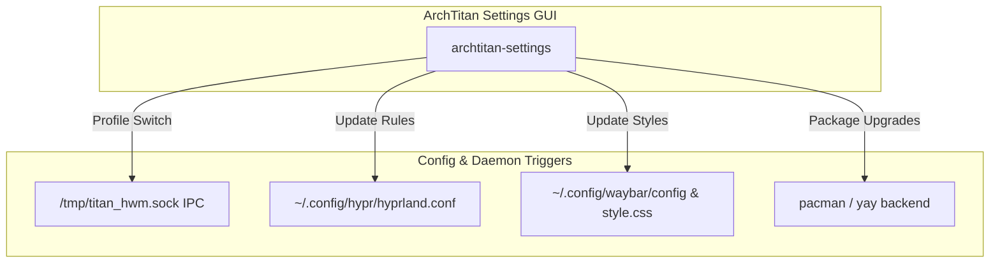

# ArchTitan Settings

**ArchTitan Settings** (`archtitan-settings` / `titan-settings`) is ArchTitan OS's first-party system control center. Developed in C++/Qt6, it provides a centralized graphical user interface to configure display settings, window compositor behaviors, Waybar panels, Titan Hardware Manager profiles, themes, and system updates.

---

## Key Features

- **THM Profile Manager**: Manages active Titan Hardware Manager profiles (System Dev, Web Dev, Android Dev, Casual, Neutral) with real-time cgroup telemetry status.
- **Hyprland & Display Configuration**: Adjust monitor resolution, refresh rate, scaling, window gaps, borders, animations, and rounded corners without manually editing `hyprland.conf`.
- **Waybar Control**: Customize status panel modules, positions, pill styling, and auto-hide behaviors.
- **Theme & Aesthetic Customization**: Apply Catppuccin Mocha color presets, GTK/Qt dark themes, Papirus icon packages, and custom desktop wallpapers.
- **System Updates & Maintenance**: Perform system package upgrades via `pacman`/`yay`, inspect sandbox launch logs, and clean package caches.

---

## System Integration



---

## Executable Locations & Files

| Path | Description |
| :--- | :--- |
| `/usr/local/bin/archtitan-settings` | Primary compiled Qt6 binary |
| `/usr/local/bin/titan-settings` | Symlink helper for CLI/launcher calls |
| `/usr/share/applications/archtitan-settings.desktop` | Desktop menu entry |
| `/usr/share/icons/hicolor/scalable/apps/archtitan-settings.svg` | App icon |

---

## Launching ArchTitan Settings

- **From App Launcher**: Search for **ArchTitan Settings** in Rofi (<kbd>Super</kbd> + <kbd>Space</kbd>).
- **From Terminal**:
  ```bash
  titan-settings
  ```
- **Sandbox Execution**: Runs under `titan-exec-hook` with policy rules allowing access to `~/.config` configuration files.

---

## Source & Local Build

Source files live in [`archtitan-settings/`](file:///home/msfvenom/custom-os-build/archtitan-settings/) in the repository root.

To build and install ArchTitan Settings locally:

```bash
cd archtitan-settings
cmake -B build -DCMAKE_BUILD_TYPE=Release
cmake --build build
sudo cp build/archtitan-settings /usr/local/bin/archtitan-settings
```
