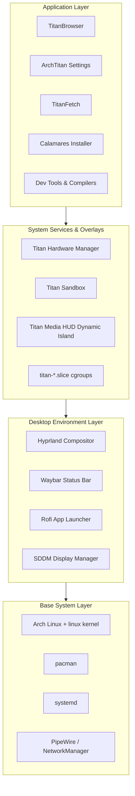
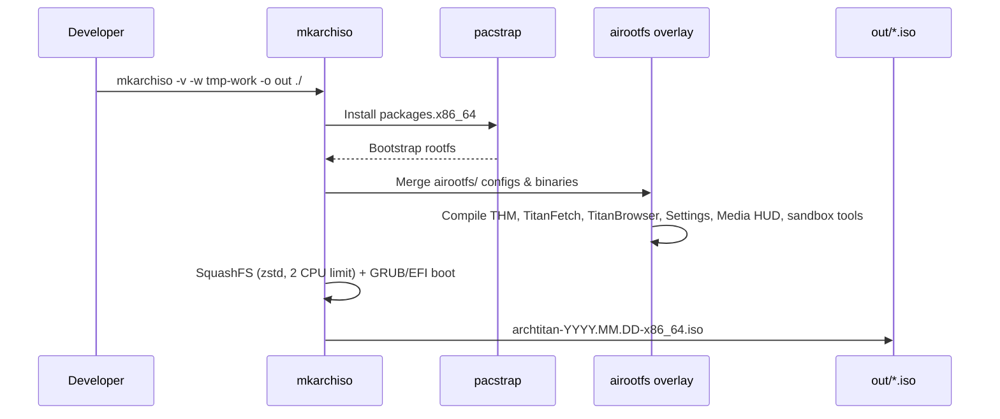
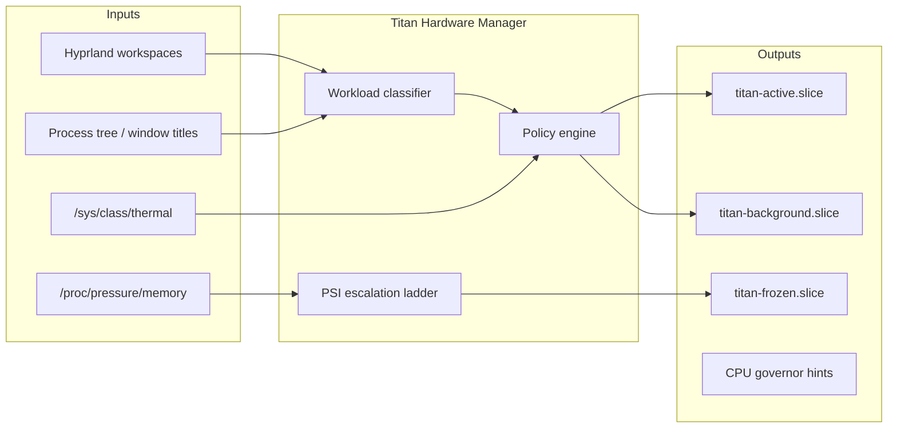
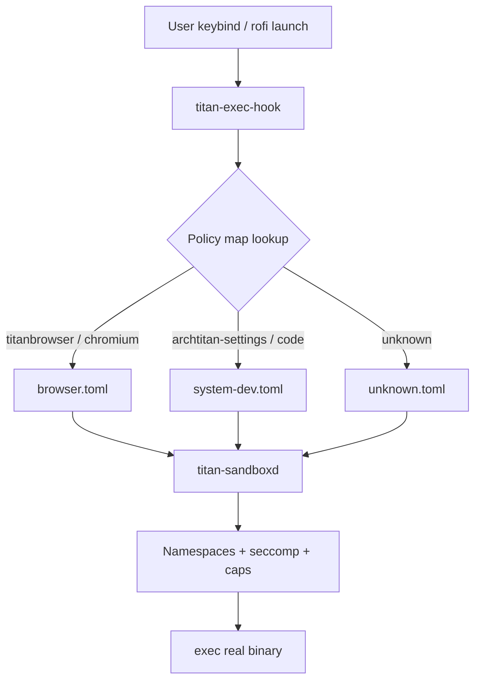

# Architecture

ArchTitan is organized into four layers. Each layer has a clear responsibility, and custom services sit between the Wayland compositor and the kernel rather than patching behavior at the application level.

---

## Layer Overview

| Layer | Purpose | Key Technologies |
| :--- | :--- | :--- |
| **Base** | Bootable rootfs, kernel, firmware, networking | archiso, pacstrap, mkinitcpio, systemd |
| **Desktop** | Wayland session, input, visuals, session management | Hyprland, Waybar, Rofi, SDDM, PipeWire |
| **Services & Overlays** | Workload-aware resource control, app isolation, media overlays | C++17 daemons, cgroups v2, PSI, seccomp, QML Dynamic Island |
| **Application** | User-facing tools, browser, settings GUI, and installer | TitanBrowser (Qt6 WebEngine), ArchTitan Settings (Qt6), TitanFetch (Qt6), Calamares |

---

## ISO Build Pipeline

The repository is an [archiso](https://wiki.archlinux.org/title/Archiso) profile. `profiledef.sh` defines image metadata, compression, and file permissions for the live environment.

### Key paths

| Path | Role |
| :--- | :--- |
| `profiledef.sh` | ISO name, boot modes, squashfs options (zstd CPU limits), permission map |
| `packages.x86_64` | Package list installed into live/install target |
| `pacman.conf` | Mirror and repo configuration for the build |
| `airootfs/` | Overlay copied onto the rootfs (configs, systemd units, binaries) |
| `grub/` / `efiboot/` | Bootloader configuration & unicode font resources |
| `subsystems/` | Dedicated directories for all 9 group subsystems (THM, Sandbox, Media HUD, etc.) |
| `titan-browser-source/` | First-party TitanBrowser Qt6 WebEngine source |
| `archtitan-settings/` | ArchTitan Settings C++/Qt6 control center source |
| `titan-hwm-source/` | Titan Hardware Manager C++ daemon source |
| `titanfetch-src/` | TitanFetch C++/Qt6 application source |
| `sandbox/` | Titan Sandbox C++ daemon & policy loader source |
| `.github/` | GitHub Actions CI workflows, CODEOWNERS, and PR template |

---

## Titan Hardware Manager — Control Loop

THM is the central intelligence service. It watches Hyprland workspace state, running processes, and memory pressure, then assigns processes to cgroup slices and applies escalation when PSI thresholds are crossed.

### Workload profiles

THM classifies activity into five profiles:

| Profile | Typical triggers | Resource bias |
| :--- | :--- | :--- |
| **Casual** | TitanBrowser, media player, workspace 1 | Balanced; background apps deprioritized |
| **Web Dev** | Node, Vite, webpack, workspace 2 | Higher CPU/memory for build daemons & LSPs |
| **Android Dev** | adb, gradle, Android Studio, ws 3 | Protects emulator + build toolchain |
| **System Dev** | clangd, cargo, cmake, IDE, ws 4–5 | Aggressive protection for compilers & LSPs |
| **Neutral** | No strong signal | Default policy |

Classification uses a **3-signal fusion** approach: process names, window titles, and working directories — not workspace number alone.

---

## Titan Sandbox — Launch Interception

Every user-initiated app launch from Hyprland keybindings goes through `titan-exec-hook`, which resolves a TOML policy and delegates to `titan-sandboxd`. System `exec-once` daemons (Waybar, PipeWire, etc.) are intentionally **not** sandboxed.

Policies define filesystem allowlists, network access, device nodes, and syscall risk tiers. See [Titan Sandbox](Titan-Sandbox) for policy authoring.

---

## IPC & State Files

| Path | Purpose |
| :--- | :--- |
| `/tmp/titan_hwm.sock` | THM UNIX socket — CLI commands (`titan-hwm switch`, etc.) |
| `/tmp/titan_hwm_state` | Current profile and last action (read by CLI/Waybar/Media HUD) |
| `/usr/local/bin/titan-hud-gpu` | Telemetry provider script for Titan Media HUD |
| `/usr/local/bin/titan-hud-context` | Workspace focus & THM state reader for Titan Media HUD |
| `/var/log/titan-sandbox/sandbox.log` | Sandbox launch and policy resolution logs |

---

## Security Model

- **THM runs as root** — required for cgroup management, cross-user signals, and governor writes. It is scoped to graphical-session lifecycle via systemd.
- **Sandbox runs per-app** — reduces blast radius of compromised GUI apps; not a replacement for firejail/bubblewrap for untrusted code review.
- **Live ISO Immutability Guard** — `archtitan-immutable-guard.service` handles squashfs/overlayfs immutability with non-blocking error flags (`ExecStart=-`, `SuccessExitStatus=0 1 2 255`) ensuring live booting never hangs.
- **Live ISO** — screen lock is disabled (`Super+L` noop) to prevent lockout; Calamares runs via `launch-installer` handling Wayland/XWayland root socket permissions.

---

## Planned Architecture (Under Active Development)

These components appear in project documentation and FYP materials and are organized in `subsystems/`:

- **TitanShare** — mDNS P2P file transfer (Linux daemon + Android app)
- **TitanMirror** — Wayland-native Android screen mirroring
- **Auto GPU Switcher** — automated iGPU/dGPU PRIME routing
- **TITAN AI** — OS-level project introspection and developer AI assistant
- **TITAN Task Manager** — advanced process scheduling manager

See [Roadmap & Status](Roadmap-and-Status) for the complete implementation matrix.
