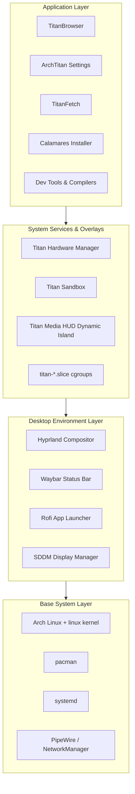
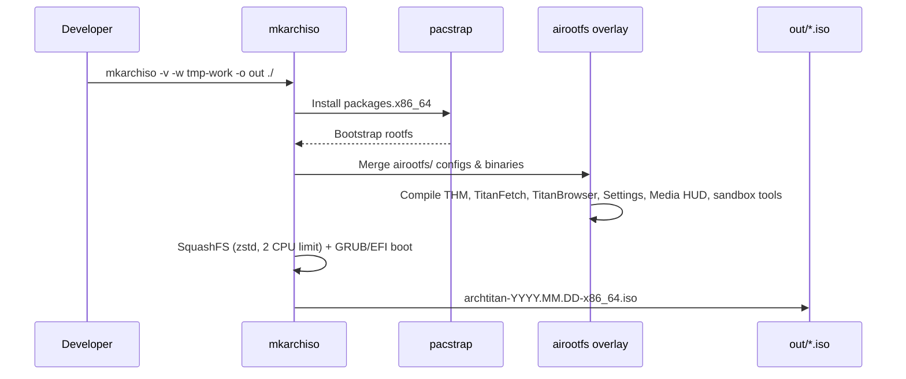
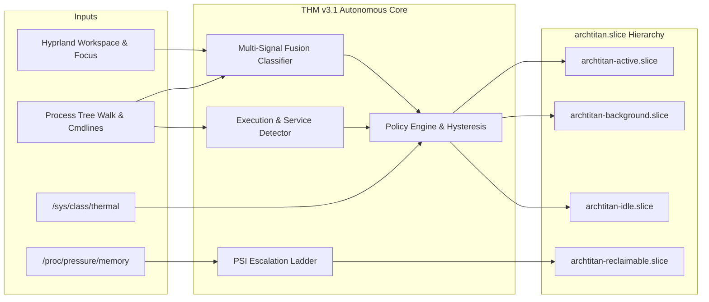
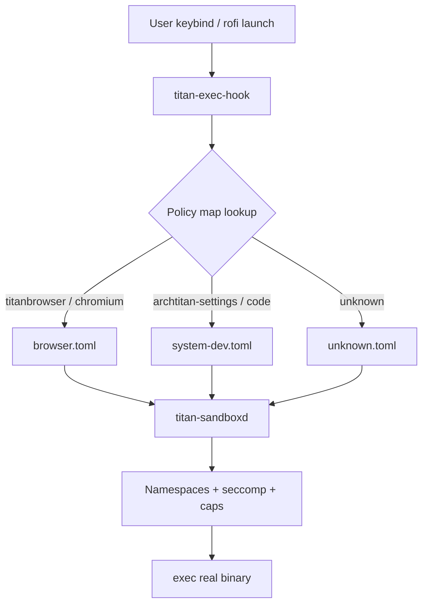

# Architecture

ArchTitan is organized into four layers. Each layer has a clear responsibility, and custom services sit between the Wayland compositor and the kernel rather than patching behavior at the application level.

---

## Layer Overview

| Layer | Purpose | Key Technologies |
| :--- | :--- | :--- |
| **Base** | Bootable rootfs, kernel, firmware, networking | archiso, pacstrap, mkinitcpio, systemd |
| **Desktop** | Wayland session, input, visuals, session management | Hyprland, Waybar, Rofi, SDDM, PipeWire |
| **Services & Overlays** | Workload-aware resource control, app isolation, media overlays | C++17 daemons, cgroups v2, PSI, seccomp, QML Dynamic Island |
| **Application** | User-facing tools, browser, settings GUI, and installer | TitanBrowser (Qt6 WebEngine), ArchTitan Settings (Qt6), TitanFetch (Qt6), Calamares |

---

## ISO Build Pipeline

The repository is an [archiso](https://wiki.archlinux.org/title/Archiso) profile. `profiledef.sh` defines image metadata, compression, and file permissions for the live environment.

### Key paths

| Path | Role |
| :--- | :--- |
| `profiledef.sh` | ISO name, boot modes, squashfs options (zstd CPU limits), permission map |
| `packages.x86_64` | Package list installed into live/install target |
| `pacman.conf` | Mirror and repo configuration for the build |
| `airootfs/` | Overlay copied onto the rootfs (configs, systemd units, binaries) |
| `grub/` / `efiboot/` | Bootloader configuration & unicode font resources |
| `subsystems/` | Dedicated directories for all 9 group subsystems (THM v3.1, Sandbox, Media HUD, etc.) |
| `titan-browser-source/` | First-party TitanBrowser Qt6 WebEngine source |
| `archtitan-settings/` | ArchTitan Settings C++/Qt6 control center source |
| `titan-hwm-v3/` | Titan Hardware Manager v3.1 C++20 autonomous resource orchestrator source |
| `titanfetch-src/` | TitanFetch C++/Qt6 application source |
| `sandbox/` | Titan Sandbox C++ daemon & policy loader source |
| `.github/` | GitHub Actions CI workflows, CODEOWNERS, and PR template |

---

## Titan Hardware Manager (THM v3.1) — Autonomous Control Loop

THM v3.1 is the central resource intelligence service written in C++20. It continuously samples Hyprland workspace state, process trees, and kernel PSI metrics every 200ms, routing workloads across `archtitan.slice` sub-slices with zero foreground jitter.

### Workload Taxonomy & Invariant Protection

THM v3.1 evaluates processes using **multi-signal fusion** (process hierarchy, Hyprland window titles, CWD project signatures, and cmdline drift detection):

| Workload Type | Identified Binaries & Workflows | Allocation & Invariant Protection |
| :--- | :--- | :--- |
| **`COMPILER`** | `gcc`, `clang`, `rustc`, `cargo`, `ninja`, `cmake` | High CPU priority; protected from freezing while compiling in background |
| **`DEVELOPMENT_SERVICE`** | `vite`, `nodemon`, `webpack`, `tsc --watch`, `pytest`, `jest` | Watcher/runner awareness; remains EXECUTING during idle epoll pauses |
| **`SERVICE`** | `dockerd`, `podman`, `redis-server`, `mysqld`, `postgres`, `mongod` | **Immunity invariant**: Strictly immune to freeze and memory reclaim |
| **`VM`** | `qemu-system-*`, `libvirtd`, `firecracker`, Android Emulator | **Immunity invariant**: Strictly immune to freeze (prevents guest timer drift) |
| **`BROWSER`** | `titanbrowser`, `chromium`, `firefox`, `zen-browser` | Latency-sensitive root protection; renderers freeze via cgroups only (no SIGSTOP) |
| **`MEDIA`** | `pipewire`, `spotify`, `mpv`, `vlc` | **Audio whitelist**: Never frozen or deprioritized |

For in-depth architectural details, see the dedicated [Titan Hardware Manager](Titan-Hardware-Manager) documentation.

---

## Titan Sandbox — Launch Interception

Every user-initiated app launch from Hyprland keybindings goes through `titan-exec-hook`, which resolves a TOML policy and delegates to `titan-sandboxd`. System `exec-once` daemons (Waybar, PipeWire, etc.) are intentionally **not** sandboxed.

Policies define filesystem allowlists, network access, device nodes, and syscall risk tiers. See [Titan Sandbox](Titan-Sandbox) for policy authoring.

---

## IPC & State Files

| Path | Purpose |
| :--- | :--- |
| `/tmp/titan_hwm.sock` | THM UNIX socket — CLI commands (`titan-hwm switch`, etc.) |
| `/tmp/titan_hwm_state` | Current profile and last action (read by CLI/Waybar/Media HUD) |
| `/usr/local/bin/titan-hud-gpu` | Telemetry provider script for Titan Media HUD |
| `/usr/local/bin/titan-hud-context` | Workspace focus & THM state reader for Titan Media HUD |
| `/var/log/titan-sandbox/sandbox.log` | Sandbox launch and policy resolution logs |

---

## Security Model

- **THM runs as root** — required for cgroup management, cross-user signals, and governor writes. It is scoped to graphical-session lifecycle via systemd.
- **Sandbox runs per-app** — reduces blast radius of compromised GUI apps; not a replacement for firejail/bubblewrap for untrusted code review.
- **Live ISO Immutability Guard** — `archtitan-immutable-guard.service` handles squashfs/overlayfs immutability with non-blocking error flags (`ExecStart=-`, `SuccessExitStatus=0 1 2 255`) ensuring live booting never hangs.
- **Live ISO** — screen lock is disabled (`Super+L` noop) to prevent lockout; Calamares runs via `launch-installer` handling Wayland/XWayland root socket permissions.

---

## Planned Architecture (Under Active Development)

These components appear in project documentation and FYP materials and are organized in `subsystems/`:

- **TitanShare** — mDNS P2P file transfer (Linux daemon + Android app)
- **TitanMirror** — Wayland-native Android screen mirroring
- **Auto GPU Switcher** — automated iGPU/dGPU PRIME routing
- **TITAN AI** — OS-level project introspection and developer AI assistant
- **TITAN Task Manager** — advanced process scheduling manager

See [Roadmap & Status](Roadmap-and-Status) for the complete implementation matrix.
