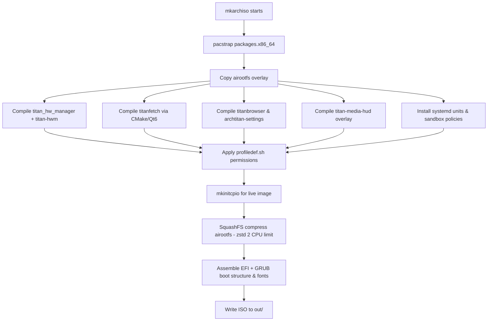

# Building the ISO

ArchTitan is built with the official Arch Linux `archiso` tooling. You need a running Arch Linux (or Arch-based) host with sufficient disk space and network access.

---

## Prerequisites

### Required packages

```bash
sudo pacman -S archiso git base-devel cmake qt6-base qt6-webengine
```

| Package | Why |
| :--- | :--- |
| `archiso` | ISO generation (`mkarchiso`) |
| `base-devel` | Compiles THM, TitanFetch, TitanBrowser, Settings during build |
| `cmake` + `qt6-base` + `qt6-webengine` | Build dependencies for TitanFetch, TitanBrowser, and ArchTitan Settings |

### Hardware recommendations

| Resource | Minimum | Recommended |
| :--- | :--- | :--- |
| Free disk | 15 GB | 30 GB+ |
| RAM | 4 GB | 8 GB+ |
| CPU | 2 cores | 4+ cores (SquashFS zstd compression is limited to 2 CPUs to prevent memory exhaustion) |

---

## Clone & Prepare

```bash
git clone https://github.com/GitGuru29/archtitan-os.git
cd archtitan-os
```

Clean previous artifacts before a fresh build:

```bash
sudo rm -rf tmp-work out
```

---

## Build Command

```bash
sudo mkarchiso -v -w tmp-work/ -o out/ ./
```

### Flags explained

| Flag | Meaning |
| :--- | :--- |
| `-v` | Verbose output |
| `-w tmp-work/` | Build workspace (can be deleted after success) |
| `-o out/` | Output directory for the final ISO |
| `./` | Path to this archiso profile (repo root) |

On success, the ISO appears as:

```
out/archtitan-YYYY.MM.DD-x86_64.iso
```

The date comes from `profiledef.sh` → `iso_version`.

---

## Build Pipeline Internals



### What `profiledef.sh` controls

- **ISO identity** — name, label, publisher, version string
- **Boot mode** — UEFI via GRUB (`bootmodes=('uefi.grub')`)
- **Compression** — SquashFS with zstd, limited CPU thread budget to prevent build OOM
- **File permissions** — shadow files, sandbox log dirs, executable permissions for binaries and HUD scripts

---

## Rebuilding Individual Components

During development you can rebuild individual applications and services without running a full ISO build cycle:

### Titan Hardware Manager (`titan-hwm`)
```bash
./install.sh
```

### TitanFetch (`titanfetch`)
```bash
cd titanfetch-src
cmake -B build -DCMAKE_BUILD_TYPE=Release
cmake --build build
sudo cp build/titanfetch /usr/bin/titanfetch
```

### TitanBrowser (`titanbrowser`)
```bash
cd titan-browser-source
cmake -B build -DCMAKE_BUILD_TYPE=Release
cmake --build build
sudo cp build/titanbrowser /usr/local/bin/titanbrowser
```

### ArchTitan Settings (`archtitan-settings`)
```bash
cd archtitan-settings
cmake -B build -DCMAKE_BUILD_TYPE=Release
cmake --build build
sudo cp build/archtitan-settings /usr/local/bin/archtitan-settings
```

### Titan Media HUD (`titan-media-hud`)
```bash
cd subsystems/titan-media-hud
cmake -B build -DCMAKE_BUILD_TYPE=Release
cmake --build build
sudo cp build/titan-media-hud /usr/local/bin/titan-media-hud
```

---

## Reproducible Builds

Set `SOURCE_DATE_EPOCH` before building to pin timestamps in the ISO label and version:

```bash
export SOURCE_DATE_EPOCH=$(date -d '2026-01-01' +%s)
sudo mkarchiso -v -w tmp-work/ -o out/ ./
```

---

## Verify the ISO

```bash
# Check file type
file out/archtitan-*.iso

# Mount and inspect (optional)
sudo mount -o loop out/archtitan-*.iso /mnt
ls /mnt/arch/
sudo umount /mnt
```

---

## Quick VM Smoke Test

After building:

```bash
./run-vm.sh
```

`run-vm.sh` automatically detects the latest built ISO in `out/` or `Downloads/`. Requires `qemu-system-x86_64` and `edk2-ovmf`. See [Installation Guide → QEMU](Installation-Guide#qemu-kvm).

---

## Common Build Failures

| Symptom | Likely cause | Fix |
| :--- | :--- | :--- |
| `pacstrap` mirror errors | Stale mirror list | Edit `pacman.conf` or run reflector on host |
| Qt6 / WebEngine not found | Missing dev packages | `sudo pacman -S qt6-base qt6-webengine cmake` |
| Permission denied on `out/` | Previous root-owned files | `sudo rm -rf out tmp-work` |
| SquashFS OOM | Low RAM during compression | Ensure `profiledef.sh` zstd options limit CPU threads or add swap |

More details: [Troubleshooting → Build Issues](Troubleshooting#build-issues).
