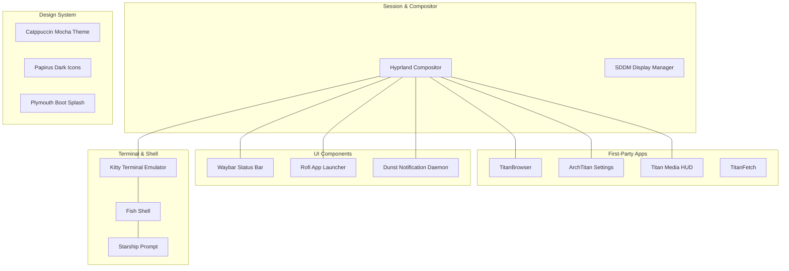

# Desktop Environment

ArchTitan OS delivers a Wayland-native desktop built around the **Hyprland** dynamic tiling window manager, unified visually with the **Catppuccin Mocha** dark palette and enhanced by first-party Qt6 desktop applications.

---

## Ecosystem Breakdown



---

## Desktop Components & Configurations

| Component | Function | Configuration File Location |
| :--- | :--- | :--- |
| **Hyprland** | Wayland Tiling Compositor (v0.53+/v0.56+ block syntax) | `~/.config/hypr/hyprland.conf` |
| **Waybar** | Top dark-pill status panel with center media capsule & THM badge | `~/.config/waybar/config` & `style.css` |
| **Titan Media HUD** | Dynamic Island overlay & power menu | `subsystems/titan-media-hud/` |
| **TitanBrowser** | First-party Qt6 WebEngine browser | `titan-browser-source/` |
| **ArchTitan Settings** | System configuration GUI | `archtitan-settings/` |
| **Rofi (Wayland)** | Application launcher, window switcher, power menu | `~/.config/rofi/config.rasi` |
| **Kitty** | GPU-accelerated terminal emulator | `~/.config/kitty/kitty.conf` |
| **Fish Shell** | Interactive shell with auto-suggestions & syntax highlighting | `~/.config/fish/config.fish` |
| **Starship** | Cross-shell developer prompt | `~/.config/starship.toml` |
| **Dunst** | Notification daemon styled with rounded borders | `~/.config/dunst/dunstrc` |

---

## Essential Keybindings Reference

All keybindings use the **Super** key (Windows/Cmd key) as the main modifier:

### System & Launchers

| Keybinding | Action |
| :--- | :--- |
| <kbd>Super</kbd> + <kbd>Return</kbd> | Open Kitty Terminal |
| <kbd>Super</kbd> / <kbd>Super</kbd> + <kbd>Space</kbd> | Open Rofi App Launcher |
| <kbd>Super</kbd> + <kbd>W</kbd> | Launch Default Web Browser (**TitanBrowser**) |
| <kbd>Super</kbd> + <kbd>E</kbd> | Launch Ranger File Manager |
| <kbd>Super</kbd> + <kbd>I</kbd> | Launch Calamares Graphical Installer (via `launch-installer`) |
| <kbd>Super</kbd> + <kbd>V</kbd> | Open Rofi Clipboard History Manager |
| <kbd>Super</kbd> + <kbd>Shift</kbd> + <kbd>S</kbd> | Take Region Screenshot (via `grim` + `slurp`) |
| <kbd>Super</kbd> + <kbd>Escape</kbd> | Open Titan Power Menu / Rofi Power Menu |

### Window Management

| Keybinding | Action |
| :--- | :--- |
| <kbd>Super</kbd> + <kbd>Q</kbd> | Close active window |
| <kbd>Super</kbd> + <kbd>F</kbd> | Toggle Fullscreen mode |
| <kbd>Super</kbd> + <kbd>Shift</kbd> + <kbd>Space</kbd> | Toggle Floating mode for active window |
| <kbd>Super</kbd> + <kbd>H</kbd> / <kbd>J</kbd> / <kbd>K</kbd> / <kbd>L</kbd> | Move focus Left / Down / Up / Right |
| <kbd>Super</kbd> + <kbd>Shift</kbd> + <kbd>H</kbd> / <kbd>J</kbd> / <kbd>K</kbd> / <kbd>L</kbd> | Move window position Left / Down / Up / Right |
| <kbd>Super</kbd> + Left Click Drag | Move floating window |
| <kbd>Super</kbd> + Right Click Drag | Resize floating window |

### Workspaces

| Keybinding | Action |
| :--- | :--- |
| <kbd>Super</kbd> + <kbd>1</kbd> .. <kbd>9</kbd> | Switch to Workspace 1 .. 9 |
| <kbd>Super</kbd> + <kbd>Shift</kbd> + <kbd>1</kbd> .. <kbd>9</kbd> | Move active window to Workspace 1 .. 9 |
| <kbd>Super</kbd> + <kbd>Mouse Scroll</kbd> | Cycle through active workspaces |

---

## Modern Hyprland Window Rules Syntax (v0.53+)

ArchTitan OS uses Hyprland v0.53+/v0.56+ named block syntax for window rules:

```ini
# Calamares installer window rule block
windowrule {
    name = calamares-rule
    match {
        class = ^(calamares)$
    }
    float = true
    center = true
}
```

### VM Rendering Flags (Aquamarine Backend)

For QEMU, VirtualBox, and virtualized GPU environments running Hyprland 0.56+:

```ini
env = AQ_NO_MODIFIERS,1

cursor {
    no_hardware_cursors = true
}
```

---

## Catppuccin Mocha Theme Specification

ArchTitan OS enforces the Catppuccin Mocha color palette across all applications:

```
Base      : #1e1e2e  (Background)
Mantle    : #181825  (Darker background)
Crust     : #11111b  (Deepest dark)
Text      : #cdd6f4  (Primary text)
Subtext0  : #a6adc8  (Secondary text)
Blue      : #89b4fa  (Accent primary)
Lavender  : #b4befe  (Accent secondary)
Sapphire  : #74c7ec  (Active window border gradient 1)
Teal      : #94e2d5  (Active window border gradient 2)
Red       : #f38ba8  (Error / urgent)
Green     : #a6e3a1  (Success / active state)
```

### Window Decoration Settings

- **Border Width**: `2px`
- **Active Border**: `gradient(45deg, 0xff74c7ec, 0xff94e2d5)`
- **Inactive Border**: `0xff313244`
- **Corner Rounding**: `10px`
- **Blur**: Enabled (`size = 6`, `passes = 2`, `new_optimizations = true`)
- **Drop Shadow**: Enabled (`range = 15`, `render_power = 3`)
- **Animations**: Overshot spring curve (`bezier = overshot, 0.05, 0.9, 0.1, 1.05`)

---

## Redesigned Waybar & Dynamic Island Integration

Waybar features a dark pill design language matching the technical Linux aesthetic:

- **Blue Active Workspace Pill**: Highlighted capsule indicating the active Hyprland workspace.
- **Center Media Capsule Trigger**: Interactive central module that displays current media/audio track and triggers the **Titan Media HUD** Dynamic Island overlay when clicked.
- **THM Workload Badge**: Displays current workload profile (`[SYS]`, `[WEB]`, `[AND]`, `[CAS]`) in vibrant accent colors.
- **Hardware Telemetry**: Displays live CPU usage %, RAM consumption %, CPU temperature, and active PipeWire volume level.
