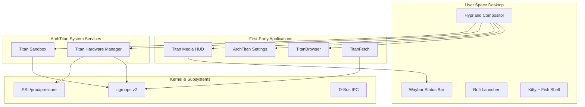

# ArchTitan OS Wiki

Welcome to the ArchTitan OS documentation. This wiki covers everything from building the live ISO to configuring the custom daemons and first-party applications that make ArchTitan a high-performance Wayland distribution.

> **Project status:** Active multi-member development. Core ISO build pipeline, THM daemon, Titan Sandbox, TitanFetch, TitanBrowser, ArchTitan Settings, and Titan Media HUD are functional and shipped in the ISO. Group subsystems (Auto GPU Switcher, TITAN AI, TITAN Task Manager, TITAN Share, TITAN Mirror) are structured under `subsystems/`.

---

## What is ArchTitan?

ArchTitan is a custom, developer-focused Linux distribution built on [Arch Linux](https://archlinux.org) using [archiso](https://wiki.archlinux.org/title/Archiso). It ships a Wayland-native Hyprland desktop, first-party system services written in C++17, native Qt6 applications (TitanBrowser, ArchTitan Settings, TitanFetch), and a curated toolchain for software development — without the idle overhead of a full GNOME or KDE stack.

The project was originally developed as **TitanArch**, a Final Year Project focused on context-aware resource management for developer workflows.

---

## Quick Links

| Topic | Page |
| :--- | :--- |
| System design & layers | [Architecture](Architecture) |
| Build a bootable ISO | [Building the ISO](Building-the-ISO) |
| Install to disk or VM | [Installation Guide](Installation-Guide) |
| Resource orchestration daemon | [Titan Hardware Manager](Titan-Hardware-Manager) |
| Per-app sandboxing | [Titan Sandbox](Titan-Sandbox) |
| System info CLI/GUI | [TitanFetch](TitanFetch) |
| First-party WebEngine browser | [Titan Browser](Titan-Browser) |
| System control center | [ArchTitan Settings](ArchTitan-Settings) |
| Dynamic Island overlay & HUD | [Titan Media HUD](Titan-Media-HUD) |
| Hyprland, Waybar, keybindings | [Desktop Environment](Desktop-Environment) |
| Repo layout & contributing | [Developer Guide](Developer-Guide) |
| What's done vs planned | [Roadmap & Status](Roadmap-and-Status) |
| Common issues | [Troubleshooting](Troubleshooting) |

---

## Core Philosophy

1. **Wayland native** — Hyprland compositor, no X11 session by default.
2. **Resource aware** — Titan Hardware Manager (THM) uses cgroups v2, PSI, and workload classification to keep the active session responsive.
3. **First-party desktop stack** — Lightweight Qt6 native browser (TitanBrowser), system control center (ArchTitan Settings), and Dynamic Island media overlay (Titan Media HUD).
4. **Aesthetic cohesion** — Catppuccin Mocha theming across terminal, bar, launcher, apps, and Plymouth boot splash.
5. **Developer ready** — Fish + Starship shell, VS Code, Docker, Rust/Go/Node toolchains, and Android tooling hooks out of the box.

---

## System at a Glance



---

## Getting Started

### Try the live ISO

1. [Build the ISO](Building-the-ISO) on an Arch Linux host, or download a release when available.
2. Flash to USB and boot in **UEFI** mode.
3. Explore the live Hyprland desktop, then press **Super + I** to launch Calamares.

### Test in a VM

Use the included QEMU helper:

```bash
./run-vm.sh          # boot ISO
./run-vm.sh --disk   # boot installed qcow2
./run-vm.sh --fresh  # wipe disk + reinstall
```

See [Installation Guide → Virtual Machines](Installation-Guide#virtual-machines) for VirtualBox and QEMU details.

---

## External Resources

- [GitHub Repository](https://github.com/GitGuru29/archtitan-os)
- [Arch Linux Wiki](https://wiki.archlinux.org/)
- [Hyprland Wiki](https://wiki.hypr.land/)
- [archiso Documentation](https://wiki.archlinux.org/title/Archiso)

---

## License

ArchTitan project files are MIT-licensed. Arch Linux and bundled third-party software retain their respective licenses.
