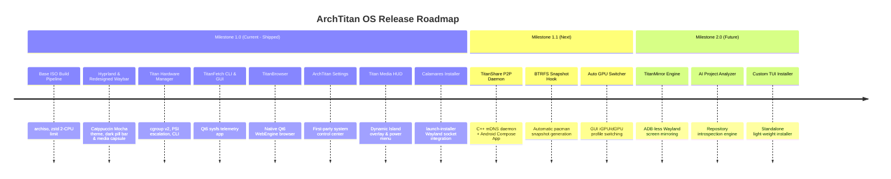

# Roadmap and Feature Status

This page tracks the current implementation state of **ArchTitan OS** components, distinguishing shipped production features in the active ISO build from planned or experimental features under active development.

---

## Component & Subsystem Implementation Matrix

| Subsystem / Component | Owner | Category | Status | Subsystem Location & Details |
| :--- | :--- | :--- | :--- | :--- |
| **archiso ISO Builder** | @GitGuru29 (Lead) | Build Pipeline | 🟢 **Shipped** | Full UEFI bootable ISO profile with zstd compression (2 CPU limit) and custom overlay |
| **Hyprland Compositor** | @GitGuru29 (Lead) | Desktop Environment | 🟢 **Shipped** | v0.53+/v0.56+ window rules, Aquamarine VM backend, Catppuccin Mocha styling |
| **Titan Hardware Manager (`titan-hwm`)** | @GitGuru29 (Lead) | System Daemon | 🟢 **Shipped** | C++ daemon managing cgroup v2 slices, PSI memory pressure (`subsystems/titan-hwm/`) |
| **TitanFetch (CLI & GUI)** | @GitGuru29 (Lead) | System Info | 🟢 **Shipped** | Qt6 telemetry dashboard & C++ sysfs reader (`subsystems/titan-fetch/`) |
| **Titan Sandbox (`titan-sandboxd`)** | @GitGuru29 (Lead) | Isolation | 🟢 **Shipped (Core)** | Linux namespaces, seccomp-bpf filters, capability drops (`subsystems/titan-sandbox/`) |
| **TitanBrowser (`titanbrowser`)** | @GitGuru29 (Lead) | Browser | 🟢 **Shipped** | First-party Qt6 WebEngine browser with low-memory tuning (`titan-browser-source/`) |
| **ArchTitan Settings (`archtitan-settings`)** | @GitGuru29 (Lead) | System Control | 🟢 **Shipped** | Unified C++/Qt system configuration manager (`archtitan-settings/`) |
| **Titan Media HUD (`titan-media-hud`)** | @GitGuru29 (Lead) | Desktop Overlay | 🟢 **Shipped** | Dynamic Island overlay, Waybar center capsule, GPU & context HUD (`subsystems/titan-media-hud/`) |
| **Waybar Integration** | @GitGuru29 (Lead) | Desktop Panel | 🟢 **Shipped** | Dark pill bar with center media capsule trigger and active THM workload badge |
| **Calamares Installer** | @GitGuru29 (Lead) | Installation | 🟢 **Shipped** | Calamares graphical installer integrated with `launch-installer` Wayland/XWayland root socket helper |
| **QEMU Test Runner (`run-vm.sh`)** | @GitGuru29 (Lead) | Developer Utilities | 🟢 **Shipped** | Bash script with ISO auto-detection in `out/`/`Downloads/`, persistent disk, and EFI validation |
| **Auto GPU Switcher** | @GitGuru29 (Lead) | Performance | 🟡 **In Development** | Dynamic iGPU/dGPU offloading with THM thermal integration (`subsystems/auto-gpu-switcher/`) |
| **TITAN AI** | Teammate | Intelligence | 🟡 **In Development** | Repository introspection & developer AI assistant subsystem (`subsystems/titan-ai/`) |
| **TITAN Task Manager** | Teammate | Process Control | 🟡 **In Development** | Advanced task & process scheduling manager (`subsystems/titan-task-manager/`) |
| **TITAN Share** | Teammate | Cross-Device | 🟡 **In Development** | Peer-to-peer file sharing daemon & Android client (`subsystems/titan-share/`) |
| **TITAN Mirror** | Teammate | Cross-Device | 🟡 **In Development** | Wayland-native screen mirroring subsystem (`subsystems/titan-mirror/`) |

---

## Release Roadmap

---

## Detailed Milestone Descriptions

### Milestone 1.0 — Core Foundation (Shipped)
- **Goal**: Deliver a stable, bootable developer-focused Arch distribution with first-party cgroup resource management and custom Qt6 desktop applications.
- **Key Deliverables**:
  - `titan_hw_manager` C++ privilege daemon running as systemd service.
  - Hyprland Wayland environment preconfigured with Catppuccin Mocha styling, updated v0.53+/v0.56+ window rules, and VM GPU rendering support (`AQ_NO_MODIFIERS=1`).
  - Compiled C++/Qt6 `titanfetch` system information tool.
  - Native `titanbrowser` Qt6 WebEngine browser with low-memory tuning as default browser (`Super + W`).
  - Native `archtitan-settings` system configuration GUI.
  - Dynamic Island `titan-media-hud` overlay and redesigned dark pill Waybar.
  - Robust live ISO boot with `archtitan-immutable-guard.service` non-blocking fallback.

---

### Milestone 1.1 — Ecosystem & Recovery (Active Development)
- **Goal**: Introduce cross-device local file sharing and automated system recovery.
- **Key Features**:
  - **TitanShare**: Local network peer-to-peer file transfer system (mDNS discovery, secure UNIX sockets, Jetpack Compose Android client).
  - **BTRFS Rollback**: Pacman hooks that trigger snapper snapshots prior to package updates, exposing boot entries in GRUB.
  - **Auto GPU Switcher**: Dynamic GPU profile switching based on active THM workload (routing compile/render tasks to dGPU).

---

### Milestone 2.0 — AI & Native Display (Future Planning)
- **Goal**: Add intelligence layer and low-latency display mirroring.
- **Key Features**:
  - **AI Project Analyzer**: Analyzes repository structure, lockfiles (`cargo.lock`, `package.json`), and build targets to output optimal build flags and environment variables.
  - **TitanMirror**: Low-latency H.264 screen mirroring for Android devices over local Wi-Fi directly into a Wayland surface without requiring USB ADB.
