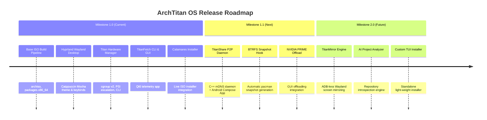

# Roadmap and Feature Status

This page tracks the current implementation state of **ArchTitan OS** components, distinguishing shipped production features in the active ISO build from planned or experimental features under active development.

---

## Component Implementation Matrix

| Component | Category | Status | Implementation Details |
| :--- | :--- | :--- | :--- |
| **archiso ISO Builder** | Build Pipeline | 🟢 **Shipped** | Full UEFI bootable ISO profile with zstd compression and custom overlay |
| **Hyprland Compositor** | Desktop Environment | 🟢 **Shipped** | Custom keybindings, overshot animations, Catppuccin Mocha styling |
| **Titan Hardware Manager (`titan-hwm`)** | System Daemon | 🟢 **Shipped** | C++ daemon managing cgroup v2 slices, PSI memory pressure, and 5 workload profiles |
| **THM CLI Tool (`titan-hwm`)** | CLI Tooling | 🟢 **Shipped** | UNIX socket client with manual profile switcher and live `metrics` dashboard |
| **Titan Sandbox (`titan-sandboxd`)** | Isolation | 🟢 **Shipped (Core)** | Linux namespaces, seccomp-bpf filters, capability drops, and TOML policy loader |
| **TitanFetch CLI** | System Info | 🟢 **Shipped** | Sub-millisecond C++ sysfs/procfs reader with custom ASCII logo |
| **TitanFetch GUI** | System Info | 🟢 **Shipped** | Qt6 telemetry dashboard with live CPU/RAM/VRAM progress bars |
| **Waybar Integration** | Desktop Panel | 🟢 **Shipped** | Polling module displaying active THM workload badge and hardware telemetry |
| **Calamares Installer** | Installation | 🟢 **Shipped** | Calamares graphical installer integration launched via `Super+I` |
| **QEMU Test Runner (`run-vm.sh`)** | Developer Utilities | 🟢 **Shipped** | Bash script for boot, persistent disk, and EFI validation |
| **TitanShare P2P Transfer** | Cross-Device | 🟡 **In Development** | mDNS C++ Linux daemon & Kotlin/Jetpack Compose Android app (documented in FYP) |
| **TitanMirror Screen Mirroring** | Cross-Device | 🟡 **In Development** | Wayland-native Android screen mirroring with MediaProjection & H.264 video encoding |
| **Automated Hybrid GPU Switcher** | Performance | 🟡 **In Development** | Userspace DRM device offloading & automatic `DRI_PRIME` environment injection |
| **AI Project Analyzer** | Developer Tooling | 🟡 **In Development** | Python-based repository introspection tool recommending build flags & env settings |
| **BTRFS Auto-Snapshots** | Recovery | 🟡 **In Development** | Pacman pre-update hooks with GRUB bootloader snapshot rollback integration |

---

## Release Roadmap

---

## Detailed Milestone Descriptions

### Milestone 1.0 — Core Foundation (Shipped)
- **Goal**: Deliver a stable, bootable developer-focused Arch distribution with first-party cgroup resource management.
- **Key Deliverables**:
  - `titan_hw_manager` C++ privilege daemon running as systemd service.
  - Hyprland Wayland environment preconfigured with Catppuccin Mocha styling.
  - Compiled C++/Qt6 `titanfetch` tool.
  - Custom keybindings for development workflows.

---

### Milestone 1.1 — Ecosystem & Recovery (Active Development)
- **Goal**: Introduce cross-device local file sharing and automated system recovery.
- **Key Features**:
  - **TitanShare**: Local network peer-to-peer file transfer system (mDNS discovery, secure UNIX sockets, Jetpack Compose Android client).
  - **BTRFS Rollback**: Pacman hooks that trigger snapper snapshots prior to package updates, exposing boot entries in GRUB.
  - **Hybrid GPU Automation**: Dynamic GPU profile switching based on active THM workload (routing compile/render tasks to dGPU).

---

### Milestone 2.0 — AI & Native Display (Future Planning)
- **Goal**: Add intelligence layer and low-latency display mirroring.
- **Key Features**:
  - **AI Project Analyzer**: Analyzes repository structure, lockfiles (`cargo.lock`, `package.json`), and build targets to output optimal build flags and environment variables.
  - **TitanMirror**: Low-latency H.264 screen mirroring for Android devices over local Wi-Fi directly into a Wayland surface without requiring USB ADB.
