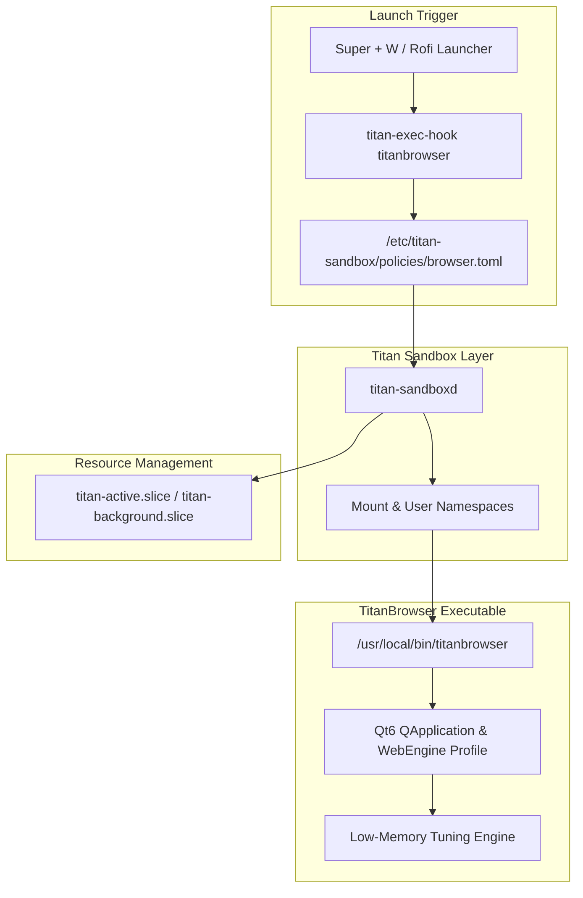

# TitanBrowser

**TitanBrowser** (`titanbrowser`) is ArchTitan OS's first-party, low-overhead web browser built with C++20 and Qt6 WebEngine. Designed specifically to integrate with ArchTitan OS's resource management engine and window environment, TitanBrowser delivers a full-featured Chrome-style browsing experience without the multi-gigabyte background footprint of generic web browsers.

---

## Key Features

- **Qt6 WebEngine Core**: Powered by Chromium's rendering engine via Qt6 WebEngine with aggressive low-memory tuning flags (`--disable-breakpad`, `--disable-gpu-shader-disk-cache`, `--in-process-gpu` where applicable).
- **Chrome-Style UI**: Modern tab bar with drag-and-drop, back/forward/reload controls, unified URL/search bar, bookmark bar, and download manager.
- **Titan Sandbox Integration**: Spawns under `titan-exec-hook` utilizing the `/etc/titan-sandbox/policies/browser.toml` security policy (isolating non-download filesystem access and dropping administrative capabilities).
- **Default System Browser**: Configured as `$browser = titanbrowser` in Hyprland, bound to `<kbd>Super</kbd> + <kbd>W</kbd>`.
- **First-Party Desktop Assets**: Native vector launcher icons (`titanbrowser.svg`, `titan-browser.svg`) and `.desktop` entry integrated into Rofi and file managers.

---

## Technical Architecture



---

## Keybindings & Usage

| Action | Shortcut / Trigger |
| :--- | :--- |
| **Launch Browser** | <kbd>Super</kbd> + <kbd>W</kbd> |
| **New Tab** | <kbd>Ctrl</kbd> + <kbd>T</kbd> |
| **Close Active Tab** | <kbd>Ctrl</kbd> + <kbd>W</kbd> |
| **Reopen Closed Tab** | <kbd>Ctrl</kbd> + <kbd>Shift</kbd> + <kbd>T</kbd> |
| **Focus Address Bar** | <kbd>Ctrl</kbd> + <kbd>L</kbd> or <kbd>F6</kbd> |
| **Reload Page** | <kbd>Ctrl</kbd> + <kbd>R</kbd> or <kbd>F5</kbd> |
| **Toggle Developer Tools** | <kbd>F12</kbd> |

---

## Executable Locations & Symlinks

| Path | Purpose |
| :--- | :--- |
| `/usr/local/bin/titanbrowser` | Primary compiled Qt6 binary |
| `/usr/local/bin/titan-browser` | System symlink wrapper for CLI compatibility |
| `/usr/share/applications/titan-browser.desktop` | XDG desktop launcher file |
| `/usr/share/icons/hicolor/scalable/apps/titanbrowser.svg` | Scalable vector icon |

---

## Sandbox Security Rules (`browser.toml`)

TitanBrowser executes inside a restricted Linux namespace environment configured in `/etc/titan-sandbox/policies/browser.toml`:

- **Read-Only System Paths**: `/usr`, `/lib64`, `/etc/ssl`
- **Read-Write User Paths**: `~/.config/titanbrowser`, `~/Downloads`
- **Device Access**: `/dev/dri/` (GPU acceleration), `/dev/snd/` (audio output)
- **Blocked Operations**: Direct `/home` scanning, access to `/etc/shadow` or root directories.

---

## Source Directory & Building

The source code is located at [`titan-browser-source/`](file:///home/msfvenom/custom-os-build/titan-browser-source/) in the repository root.

To compile TitanBrowser locally:

```bash
cd titan-browser-source
cmake -B build -DCMAKE_BUILD_TYPE=Release
cmake --build build
sudo cp build/titanbrowser /usr/local/bin/titanbrowser
```
