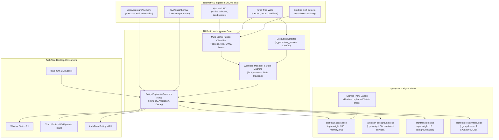
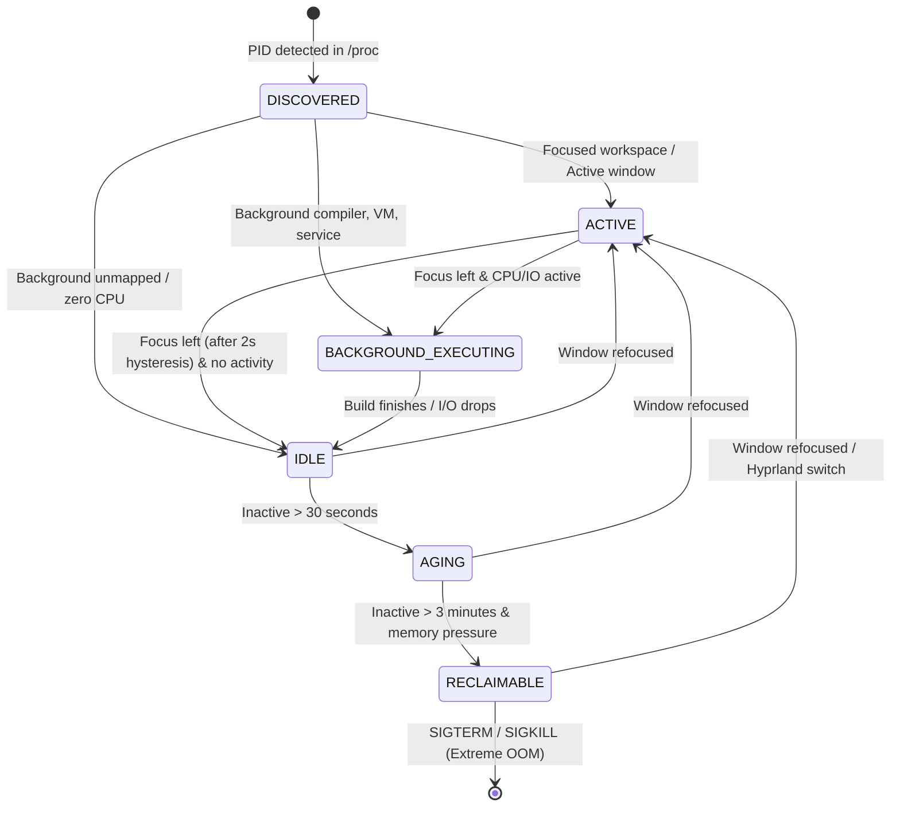

# Titan Hardware Manager (THM v3.1)

The **Titan Hardware Manager (`titan-hwm`)** is ArchTitan OS's flagship workload-centric resource orchestration daemon. Written in **C++20**, THM autonomously governs Linux kernel primitives—including **cgroups v2**, **Pressure Stall Information (PSI)**, process scheduling weights, and memory reclaim—by tracking real-time developer workflows across Wayland (Hyprland) workspaces.

Rather than relying on naive memory kill thresholds (`oomd`) or static governors, THM understands modern developer activities (compilers, language servers, persistent VMs, test runners, dev watchers, browser renderers, and audio daemons) and ensures foreground fluidity without disrupting long-running build tasks.

---

## Key Highlights & Capabilities

- **Workload Classification (Multi-Signal Fusion)**: Combines process tree walking, Hyprland window/workspace focus, CWD project signatures (`package.json`, `Cargo.toml`, `CMakeLists.txt`), GUI window titles, and dynamic cmdline drift detection.
- **cgroup v2 Resource Slices**: Dynamically routes processes across `archtitan-active.slice`, `archtitan-background.slice`, `archtitan-idle.slice`, and `archtitan-reclaimable.slice`.
- **First-Class Service & VM Immunity**: Dedicated `WorkloadType::SERVICE` and `WorkloadType::VM` classifications guarantee databases, container runtimes, QEMU, and Android emulators are never frozen or killed.
- **Browser-Safe Enforcement**: Browser roots are marked latency-sensitive; background renderer processes are frozen exclusively via cgroups (`cgroup.freeze`), strictly bypassing POSIX signals to prevent UI deadlock.
- **Workspace Leave Hysteresis**: 2-second decay dampening (10 ticks @ 200ms) prevents thrashing during rapid workspace switching.
- **Orphan Thaw Sweep**: On daemon startup, `startup_thaw_sweep()` scans `/proc` and automatically revives (`SIGCONT`) any user processes left suspended in `T` state by previous crashes or sessions.
- **Rigorous Real-World Validation**: 100% pass rate across **39 hardcore failure scenarios** (Groups A through M) validated against kernel stress, SIGSTOP races, disk sleep, and multi-monitor workspace topologies.

---

## System Architecture & Control Loop

THM operates as an autonomous event loop ticking every **200 milliseconds** without blocking system call latency.



---

## Workload Classification Taxonomy

THM categorizes all system processes into specialized `WorkloadType` classifications to apply tailored scheduling and memory protection:

| Workload Type | Identified Binaries & Signatures | Policy & Protection Level |
| :--- | :--- | :--- |
| **`COMPILER`** | `gcc`, `clang`, `clang++`, `rustc`, `cargo`, `make`, `ninja`, `cmake` | **Highest priority**. Retains `ACTIVE` or `BACKGROUND_EXECUTING`; protected from freezing while compiling. |
| **`DEVELOPMENT_SERVICE`** | `vite`, `nodemon`, `webpack`, `next`, `tsc --watch`, `pytest`, `jest`, `vitest`, `mocha` | **Protected Background**. Retains execution status even during idle CPU periods between file-watch events. |
| **`SERVICE`** | `dockerd`, `containerd`, `podman`, `redis-server`, `mysqld`, `postgres`, `mongod`, `ollama` | **Freeze & Reclaim Immune**. Never migrated to reclaimable slice; never sent SIGSTOP. |
| **`VM`** | `qemu-system-*`, `libvirtd`, `virtlogd`, `firecracker`, `crosvm`, Android emulator | **Freeze Immune**. Retains background execution status; protected from suspension to prevent guest timer drift. |
| **`BROWSER`** | `titanbrowser`, `chromium`, `firefox`, `brave`, `chrome`, `zen-browser` | **Dual Tier**. Browser root marked latency-sensitive (`KEEP_BACKGROUND` minimum). Background renderers use cgroup freeze only. |
| **`TERMINAL`** | `kitty`, `alacritty`, `foot`, `wezterm` | **Interactive Foreground**. Immediate promotion upon workspace focus; inherits children build state. |
| **`MEDIA`** | `pipewire`, `wireplumber`, `spotify`, `mpv`, `vlc`, `rhythmbox` | **Audio Whitelist Immune**. Strictly excluded from freezing and OOM score escalation. |
| **`RUNTIME`** | `node`, `python`, `dotnet`, `java`, `ruby`, `go` | Contextual; classified via parent tree and active script arguments. |
| **`GUI_APP`** | General desktop applications | Governed by active window focus and workspace visibility. |

---

## cgroup v2 Slice Hierarchy

Under `/sys/fs/cgroup/`, THM provisions an isolated cgroup tree under `archtitan.slice`:

```
/sys/fs/cgroup/archtitan.slice/
├── archtitan-active.slice/
│   ├── cpu.weight = 200
│   ├── memory.low = 4G (guaranteed slab)
│   └── io.weight = 100
├── archtitan-background.slice/
│   ├── cpu.weight = 50
│   ├── memory.low = 1G
│   └── io.weight = 50
├── archtitan-idle.slice/
│   ├── cpu.weight = 10
│   └── io.weight = 10
└── archtitan-reclaimable.slice/
    ├── cgroup.freeze = 1 (during escalation)
    └── oom_score_adj = +500 to +1000
```

### Architectural Differentiation from `systemd-oomd`

Traditional server daemons like `systemd-oomd` monitor pure memory pressure statistics in isolation, leading to destructive kills of heavy developer workloads (like an active 8-thread Rust compile or an Android emulator). 

THM solves this by coupling **cgroup PSI monitoring** with **compositor focus semantics**:
1. It knows which workspace you are looking at in Hyprland.
2. It protects child compilers spawned from background terminals if they are actively doing work.
3. It freezes non-critical background tabs and idle Electron wrappers before escalating to SIGTERM/SIGKILL.

---

## THM v3.1 Hardcore Resilience Matrix (11 Architectural Fixes)

THM v3.1 incorporates empirical architectural solutions developed to resolve 11 critical edge cases discovered during real-world stress testing:

| Issue ID | Subsystem Component | Empirical Failure Condition | v3.1 Architectural Solution |
| :--- | :--- | :--- | :--- |
| **HC-01** | `execution_detector` | DB daemons and local test servers went idle between queries and were mistakenly deprioritized. | Added `is_persistent_service()` to mark databases (`redis`, `postgres`, `mysql`, `mongod`) as permanently EXECUTING. |
| **HC-02** | `execution_detector` | Build watchers (`vite`, `nodemon`, `tsc --watch`) sleep on epoll and had CPU drop to 0%, getting marked IDLE. | Expanded `BUILD_CMDS` signature matching to recognize watch daemons as persistent build tasks. |
| **HC-03** | `daemon.cpp` | Headless processes (`workspace_id = -1`) mistakenly inherited the focused workspace ID. | Mapped headless and unmapped background processes to `workspace_id = -2` (background pool). |
| **HC-04** | `execution_detector` | Python/Node test runners (`pytest`, `jest`, `vitest`) during tear-down pauses were marked IDLE. | Added test runner patterns to active execution command table. |
| **HC-05** | `enforcement_plane` | Sending `SIGSTOP` to Chromium/Electron background renderers caused IPC pipe deadlocks. | Implemented cgroup-only freeze (`cgroup.freeze = 1`) for browser workloads, bypassing POSIX signals. |
| **HC-06** | `fusion_classifier` | Browser main root process dropped to IDLE/RECLAIMABLE when all windows were minimized. | Marked browser roots as `latency_sensitive = true`, enforcing a floor policy of `KEEP_BACKGROUND`. |
| **HC-07** | `policy_engine` | Container engines (`dockerd`, `podman`) got migrated to reclaimable slices during system RAM spikes. | Introduced `WorkloadType::SERVICE` with invariant immunity against freezing and reclaim. |
| **HC-08** | `policy_engine` | Android Studio QEMU emulators suspended during background IDE runs, corrupting guest timers. | Introduced `WorkloadType::VM` with invariant immunity against freezing. |
| **HC-09** | `workload_manager` | Rapid switching between Hyprland workspaces caused priority flapping and thrashing. | Introduced **2-second hysteresis** (10 ticks @ 200ms) on workspace exit before demotion. |
| **HC-10** | `daemon.cpp` | Process launched as shell (`bash`) executing a long compiler run was stuck with shell classification. | Implemented dynamic command-line drift detection to re-trigger classification on binary changes. |
| **HC-11** | `daemon.cpp` | Daemon restart left processes in POSIX `T` (stopped) state indefinitely. | Added `startup_thaw_sweep()` to automatically wake all user `T`-state processes with `SIGCONT` on boot. |

---

## Workload State Machine



---

## Audio Protection Whitelist

THM strictly isolates audio playback pipelines from suspension, deprioritization, and OOM scoring:

```
pipewire, pipewire-pulse, wireplumber, pulseaudio,
spotify, spotifyd, mpd, mpdris2, mpv, vlc,
rhythmbox, strawberry, deadbeef, cmus, ncmpcpp,
cantata, audacious, elisa, playerctld
```

Audio daemons and active players remain pinned with `cpu.weight = 100` regardless of workspace focus or memory pressure.

---

## CLI & Control Reference (`titan-hwm`)

The daemon exposes an IPC UNIX domain socket at `/tmp/titan_hwm.sock` and writes live JSON telemetry to `/tmp/titan_hwm_state`.

### CLI Commands

```bash
# Query current daemon state and workload allocations
titan-hwm status

# Display live terminal telemetry metrics (cgroups, PSI, active workloads)
titan-hwm metrics

# Override profile manually
titan-hwm switch system
titan-hwm switch web
titan-hwm switch android
titan-hwm switch casual
titan-hwm switch neutral

# Trigger manual orphan thaw sweep
titan-hwm thaw
```

### IPC State File (`/tmp/titan_hwm_state`)

```json
{
  "version": "3.1.0",
  "uptime_seconds": 1420,
  "active_profile": "System Dev",
  "focused_workspace": 1,
  "memory_pressure_pct": 4.2,
  "active_workloads": [
    {
      "pid": 12844,
      "name": "cargo",
      "type": "COMPILER",
      "state": "BACKGROUND_EXECUTING",
      "slice": "archtitan-active.slice",
      "cpu_pct": 742.1,
      "memory_mb": 1420
    }
  ]
}
```

---

## Standalone Test Suite & Source Verification

THM v3.1 is verified using an independent, auditable test harness:

- **Standalone Test Repository**: [`https://github.com/GitGuru29/titan-hardware-manager-test-system`](https://github.com/GitGuru29/titan-hardware-manager-test-system)
- **Source Code in OS Repo**: `titan-hwm-v3/` (subsystem in `archtitan-os`)
- **Systemd Service**: `titan-hwm.service` (`/etc/systemd/system/titan-hwm.service`)
- **Binary Target**: `/usr/local/bin/titan-hwm-daemon` and `/usr/local/bin/titan-hwm`
