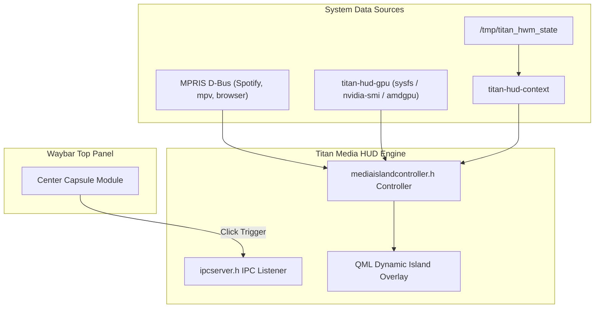

# Titan Media HUD

**Titan Media HUD** (`titan-media-hud`) is ArchTitan OS's desktop media control, hardware telemetry, and session management overlay system. Designed in Qt/QML, it brings a modern "Dynamic Island" style interactive overlay to the Wayland desktop, seamlessly integrated with the top Waybar status panel.

---

## System Overview

Titan Media HUD consists of four interconnected system services and overlays:

1. **Titan Media HUD Overlay (`titan-media-hud`)**:
   - Dynamic Island style expandable QML widget.
   - Provides media playback controls (play/pause, skip, album art, volume slider) via MPRIS D-Bus interfaces.
   - Features a vertical auto-scrolling carousel to display system alerts, audio tracks, and active THM workload notifications.

2. **Waybar Center Module Capsule**:
   - Click-to-expand trigger embedded in the center of the Waybar top panel.
   - Clicking expands the Dynamic Island HUD directly below the top bar.

3. **Titan Hardware GPU Telemetry (`titan-hud-gpu`)**:
   - Specialized telemetry collector for GPU VRAM usage, core clocks, temperature, and active render tasks.

4. **Titan Context Telemetry (`titan-hud-context`)**:
   - Gathers current workspace focus, active window title, and active THM profile state for display inside the HUD.

5. **Titan Power Menu (`titan-powermenu`)**:
   - Custom QML/Qt session manager dialog offering Lock, Logout, Suspend, Reboot, and Shutdown actions.

---

## Dynamic Island Architecture



---

## Subsystem Source & Layout

Located at [`subsystems/titan-media-hud/`](file:///home/msfvenom/custom-os-build/subsystems/titan-media-hud/):

```
subsystems/titan-media-hud/
├── src/
│   ├── ipcserver.h / ipcserver.cpp       ← IPC Unix socket listener
│   ├── mediaislandcontroller.h / .cpp    ← Dynamic Island controller
│   ├── main.cpp                          ← Qt/QML entry point
│   └── qml/                              ← Dynamic Island QML interface files
├── tests/                                ← Component unit tests
├── docs/                                 ← HUD design documentation
└── README.md                             ← Build & installation guide
```

---

## System Helpers & Executables

| Executable / Helper | Purpose | Location |
| :--- | :--- | :--- |
| `titan-media-hud` | Core QML Dynamic Island overlay daemon | `/usr/local/bin/titan-media-hud` |
| `titan-hud-gpu` | GPU telemetry gathering script | `/usr/local/bin/titan-hud-gpu` |
| `titan-hud-context` | System context & THM state reader | `/usr/local/bin/titan-hud-context` |
| `titan-powermenu` | Session power menu launcher | `/usr/local/bin/titan-powermenu` |

---

## Building & Installing

To compile and test Titan Media HUD locally:

```bash
cd subsystems/titan-media-hud
cmake -B build -DCMAKE_BUILD_TYPE=Release
cmake --build build
sudo cp build/titan-media-hud /usr/local/bin/titan-media-hud
```
