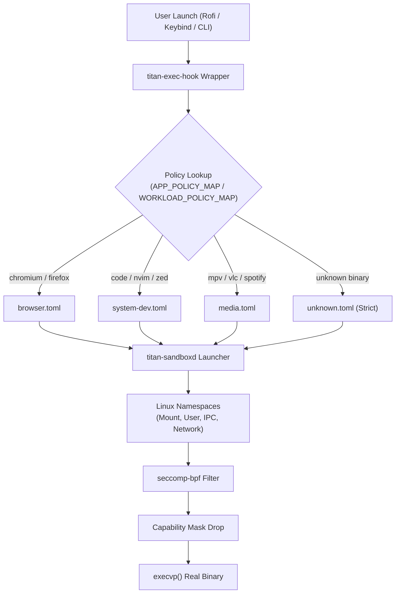

# Titan Sandbox

The **Titan Sandbox** is ArchTitan OS's application isolation system. Designed specifically for desktop and developer applications, it provides lightweight micro-isolation by constraining user space processes using Linux namespaces, seccomp-bpf system call filtering, and Linux capability drop masks.

---

## Overview

Unlike heavy container solutions (Docker, Podman) or desktop sandboxes that break desktop integration (Flatpak portals), Titan Sandbox operates at the launch hook level. When an application is launched via keybinding, Rofi launcher, or `.desktop` entry, `titan-exec-hook` resolves a declarative TOML security policy and invokes `titan-sandboxd` to execute the application inside an isolated context.

---

## Sandbox Launch Architecture



---

## Isolation Primitives

Titan Sandbox combines several kernel security facilities:

1. **Mount Namespaces (`CLONE_NEWNS`)**:
   - Restricts filesystem access using allowlists (`readonly_paths`, `readwrite_paths`).
   - Hides `/proc` metrics and sensitive system directories (`/etc/shadow`, `/root`).

2. **Network Namespaces (`CLONE_NEWNET`)**:
   - Isolates networking where policy dictates (e.g., local offline tools run with network namespace unshared and no loopback device).

3. **seccomp-bpf System Call Filters**:
   - Blocks dangerous syscalls (`ptrace`, `kexec_load`, `reboot`, `bpf`).
   - Enforces risk tiers depending on application category.

4. **Capability Drops**:
   - Drops all Linux capabilities (`CAP_SYS_ADMIN`, `CAP_NET_ADMIN`, `CAP_RAW_IO`, etc.) before executing application code.

---

## Policy Files (`/etc/titan-sandbox/policies/`)

Policies are authored in clean TOML format and installed into `/etc/titan-sandbox/policies/`:

| Policy | Target Applications | Rules Overview |
| :--- | :--- | :--- |
| `browser.toml` | Chromium, Firefox, Brave | GPU device access allowed (`/dev/dri/`), network enabled, homedir restricted to `~/.config/` & downloads |
| `system-dev.toml` | VS Code, Neovim, Zed, Cursor | Access to build toolchain (`/usr/bin/`, `/usr/include/`), project workspace read/write, terminal PTY allowed |
| `media.toml` | MPV, VLC, Spotify | Sound card access (`/dev/snd/`, PipeWire socket), read-only media library access, network unshared for local players |
| `general-gui.toml` | File managers, Chat tools | Standard desktop application policy with XDG directory access |
| `unknown.toml` | Uncategorized binaries | Fallback strict policy with maximum lockdown |

---

## THM Integration

Titan Sandbox collaborates directly with the **Titan Hardware Manager (`titan-hwm`)** via `sandbox/thm_sandbox_integration.h`:

- When `titan-exec-hook` spawns a sandboxed process, `titan-sandboxd` emits `SANDBOX_PID=<pid>`.
- THM intercepts this PID to place the sandboxed application inside `titan-active.slice` or `titan-background.slice` without losing track of child processes across namespace boundaries.

---

## Policy Authoring Guide

Below is an example policy configuration (`/etc/titan-sandbox/policies/custom-app.toml`):

```toml
[metadata]
name = "custom-app"
description = "Policy for custom developer utility"
risk_tier = "medium"

[filesystem]
read_only = [
    "/usr",
    "/lib64",
    "/etc/ssl"
]
read_write = [
    "~/.config/custom-app",
    "/tmp"
]
private_tmp = true

[network]
allow_network = true
allow_sockets = ["unix:/run/user/1000/pipewire-0"]

[devices]
allow_dri = true
allow_sound = true
```

---

## Logs & Debugging

Sandbox launch events and policy resolution errors are logged to:

```bash
/var/log/titan-sandbox/sandbox.log
```

To test launching a binary manually under sandbox isolation:

```bash
titan-sandboxd --policy /etc/titan-sandbox/policies/system-dev.toml -- /usr/bin/nvim
```
