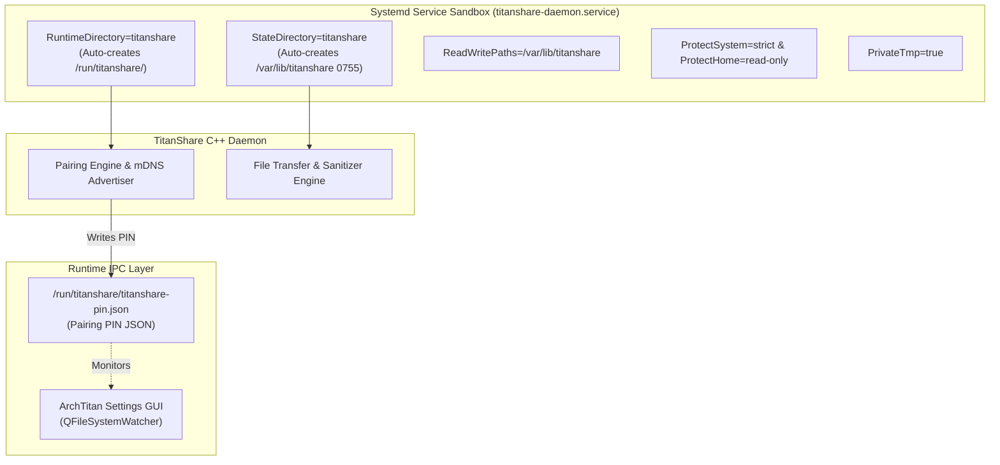

# TitanShare Subsystem (P2P File Transfer)

**TitanShare** is ArchTitan OS's native local-network peer-to-peer file transfer subsystem. Comprising a high-performance **C++ Linux daemon** and a native **Kotlin / Jetpack Compose Android application**, TitanShare enables seamless, high-throughput file exchange over local Wi-Fi / Ethernet using mDNS discovery—eliminating dependencies on cloud servers, external accounts, or USB ADB connections.

---

## 1. Storage Configuration & Directory Path Resolution

At runtime, the daemon dynamically resolves its base data directory (`DATA_DIR`) based on the process User ID (UID):

| Runner / Execution Context | Base Data Directory (`DATA_DIR`) | Description |
| :--- | :--- | :--- |
| **Root User** (`getuid() == 0`) | `/var/lib/titanshare` | Default path for system service mode (`titanshare-daemon.service`) |
| **Normal User** (`getuid() != 0`) | `$HOME/.local/share/titanshare` | User session mode execution |
| **Fallback** (No `$HOME`) | `/tmp/titanshare` | Emergency temporary storage path |

### Directory Layout & File Roles

Within the resolved `DATA_DIR`, TitanShare manages three primary directories and persistent state files:

* **Received Files Directory (`RECEIVED_FILES_DIR`)**:
  * *Path:* `<DATA_DIR>/received_files` (e.g. `/var/lib/titanshare/received_files` or `~/.local/share/titanshare/received_files`)
  * *Purpose:* Staging area for files successfully transferred from connected Android devices.
  * *Security Sanitization:* Filenames undergo automatic path sanitization (slashes and null bytes replaced/removed) to prevent directory traversal attacks.
* **Send Drop Directory (`SEND_TO_ANDROID_DIR`)**:
  * *Path:* `<DATA_DIR>/send_to_android` (e.g. `/var/lib/titanshare/send_to_android` or `~/.local/share/titanshare/send_to_android`)
  * *Purpose:* Staging directory for outgoing files queued to send from Linux to connected Android peers.
* **Session Persistence File (`SESSION_FILE_PATH`)**:
  * *Path:* `<DATA_DIR>/last_session.json`
  * *Purpose:* Persists device pairing history and socket session state across daemon restarts.

---

## 2. Configuration Overrides

System administrators and users can override storage locations via `/etc/titanshare/titanshare.conf`:

```ini
# /etc/titanshare/titanshare.conf
[daemon]
# Custom directory for received files
received_dir = /var/lib/titanshare/received_files
```

---

## 3. Systemd Sandboxing, Security & IPC Architecture

When executed as a system daemon (`titanshare-daemon.service`), TitanShare operates under strict systemd security sandboxing directives:



### Key Security Directives

* **State Directory Management**: `StateDirectory=titanshare` automatically creates `/var/lib/titanshare` with `0755` permissions upon service start. `ReadWritePaths=/var/lib/titanshare` explicitly grants write access.
* **FileSystem Protection**: `ProtectSystem=strict` mounts `/usr`, `/boot`, and `/etc` as read-only. `ProtectHome=read-only` prevents unauthorized modifications to user home directories.
* **IPC Runtime Directory**: `RuntimeDirectory=titanshare` provisions a volatile runtime folder at `/run/titanshare/`.
* **Pairing PIN IPC**: The daemon generates a secure pairing PIN written to `/run/titanshare/titanshare-pin.json`. The ArchTitan Settings GUI (`archtitan-settings`) monitors this file using `QFileSystemWatcher` to present pairing prompts without requiring elevated privileges.

---

## 4. Integration with Titan Hardware Manager (THM v3.1)

To ensure high-speed file transfers are not interrupted during system resource contention or heavy compiling tasks:

* **Protected Daemon Status**: TitanShare binaries (`titan-share`, `titanshare`) are registered in THM v3.1's `ProtectedRegistry` (`protected_registry.hpp`).
* **Resource Guarantee**: THM classifies active file transfers as protected operations, ensuring the daemon is never demoted to `archtitan-reclaimable.slice`, frozen via cgroups, or targeted by SIGSTOP/SIGKILL memory reclaim.

---

## 5. Subsystem Directory Structure

Source code and assets are organized under `subsystems/titan-share/`:

```
subsystems/titan-share/
├── src/            ← C++ daemon source code & mDNS networking
├── tests/          ← P2P transfer unit & integration test suite
├── docs/           ← Protocol specifications & storage layout
├── configs/        ← Default /etc/titanshare/titanshare.conf & systemd unit
└── README.md       ← Subsystem overview
```
